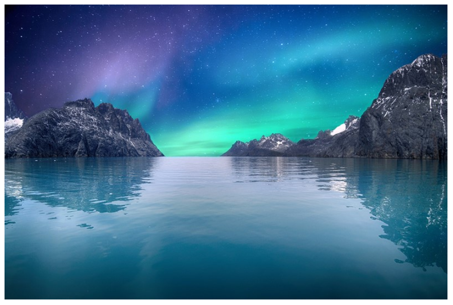

# 2021-09-10-Fri

<br/>

## 8. transform

### 💬 개요

요소의 크기, 회전, 좌표 이동 효과 등을 적용할 수 있다.  
`position`에서 이동을 할 수도 있지만, 이는 레이아웃도 같이 변경된다.  
원래 요소는 유지하되 그 상태에서 변환할 수 있다.  
`transform: function(parameter);`처럼 쓸 수 있다.  
_여러 함수를 공백 한 칸으로 구분하여 사용 가능하다!_  
_이 경우, 오른쪽에 있는 함수부터 좌측으로 역순 적용된다._

<br/>

수학적 개념에서의 2차원 평면은  
우측으로 갈 수록 x 값이 증가하고,  
상단으로 갈 수록 y 값이 증가하지만  
CSS에서 y 값은 아래로 갈 수록 증가한다는 차이가 있다.  
(0,0)은 좌측 최상단이다.

<br/>
<br/>
<br/>

### 💬 크기 - scale

`transform: scale()`은 크기를 2D 기준으로 변경한다.  
안의 인수는 (sx) 하나이거나 (sx,sy) 둘일 수 있다.  
이 인수들은 `<number>` 자료 형이고,  
원래의 크기에 곱하게 된다.

<br/>
<br/>

#### ❗ scale을 실습해보자 ❗

```html
<!DOCTYPE html>
<html lang="ko">
  <head>
    <meta charset="UTF-8" />
    <title>실습</title>
    <style>
      #trans {
        transform: scale(1.5, 0.8);
      }
    </style>
  </head>
  <body>
    
  </body>
</html>
```

<br/>
<br/>

**🆚 원본 크기**  


<br/>
<br/>

**🆚 변형 크기**  


<br/>
<br/>
 
**🆚 개발자 도구 확인**   


<br/>
<br/>

레이아웃 상 크기는 원본과 같으나, 실제 이미지의 크기는 조정되었다.  
그러므로 공간 자체는 원본 이미지만큼을 차지하는 것을 확인할 수 있었다.
<br/>
<br/>
<br/>

### 💬 회전 - rotate

`transform: rotate()`와 같이 쓰며, 안에 1개의 값을 가질 수 있다.  
`<angle>`이라는 자료형이 들어갈 수 있는데,  
360도 중의 각도를 뜻하는 `deg`, 400도 중의 각도는 `grad`,  
흔히 라디안이라 불리는 `rad`, 한바퀴가 1turn 기준인 `turn` 단위가 있다.

<br/>

값이 양수이면 시계 방향으로 회전한다.  
음수로 지정하면 반시계 방향으로 회전한다.  
_기본 값은 0이다!_

<br/>
<br/>

#### ❗ rotate를 실습해보자 ❗

```html
<!DOCTYPE html>
<html lang="ko">
  <head>
    <meta charset="UTF-8" />
    <title>실습</title>
    <style>
      #trans {
        transform: rotate(0.2turn);
      }
    </style>
  </head>
  <body>
    
  </body>
</html>
```

<br/>
<br/>

**🆚 원본 이미지**  


<br/>
<br/>

**🆚 회전 이미지**  


<br/>
<br/>

**🆚 생각**
`0.2turn`을 적용했는데, 각도를 생각해보면  
`360deg`이 `1turn`이므로, 360deg/5 = `72deg`만큼 회전했다!

<br/>
<br/>
<br/>

### 💬 이동 - translate

`transform: translate()`와 같이 쓰며,  
값은 하나 또는 `,`으로 분리한 두 개이다.  
_만약 값을 하나만 입력하면 x축으로만 이동한다!_  
`<length>`, `<percentage>`를 사용 가능하다.

<br/>
<br/>

#### ❗ translate를 실습해보자 ❗

```html
<!DOCTYPE html>
<html lang="ko">
  <head>
    <meta charset="UTF-8" />
    <title>실습</title>
    <style>
      #trans {
        transform: translate(30%, 20%);
      }
    </style>
  </head>
  <body>
    
  </body>
</html>
```

<br/>
<br/>

**🆚 원본 이미지**  


<br/>
<br/>

**🆚 이동된 이미지**  


<br/>
<br/>

**🆚 생각**
**`<percentage>`** 자료형을 쓸 때,  
그 기준이 되는 부분이 굉장히 다양했기 때문에 한 번 사용해 보았는데  
_이것은 요소 자체의 `width`와 `height`에 대한 `%`임을 확인했다!_

<br/>
<br/>
<br/>

### 💬 기울이기 - skew

`rotate()`와 유사해 보이지만, **`skew()`는 각도 값을 하나 또는 두 개 쓸 수 있다.**  
_값을 하나만 입력하면 x축 방향으로만 기울인다는 차이가 있다._  
위와 같이 쓰는 것이 목적이 아닌, y축으로만 기울이고 싶다면 `skewY()`를 쓴다.

<br/>
<br/>

#### ❗ skew를 실습해보자 ❗

```html
<!DOCTYPE html>
<html lang="ko">
  <head>
    <meta charset="UTF-8" />
    <title>실습</title>
    <style>
      #trans {
        margin: 150px;
        width: 700px;
        transform: skew(20deg, 15deg);
      }
    </style>
  </head>
  <body>
    
  </body>
</html>
```

<br/>
<br/>

**🆚 원본 이미지**  


<br/>
<br/>

**🆚 기울어진 이미지**  


<br/>
<br/>

**🆚 생각**
`rotate()`와 비슷한 느낌일 줄 알았지만,  
x,y 축을 기준으로 기울이는 함수라 그런지 완전히 달랐다.

<br/>
<br/>
<br/>

### 💬 기준점 - transform-origin

transform과 별도로 사용한다.  
**기준점이나 원점을 변경한다.**  
`initial`은 `50% 50% 0`이다. 즉 `center`이다.
결과물이 완전히 달라지지만, 애니메이션과 병행해서 잘 쓰면 의도한 바를 표현할 수 있다!

<br/>
<br/>

#### ❗ transform-origin을 실습해보자 ❗

```html
<!DOCTYPE html>
<html lang="ko">
  <head>
    <meta charset="UTF-8" />
    <title>실습</title>
    <style>
      img {
        display: block;
        margin: 0 0 0 200px;
        width: 500px;
      }
      #trans1 {
        border: 10px solid yellow;
        transform: translateY(300px);
      }
      #trans2 {
        border: 10px solid blue;
        transform: rotate(30deg);
        transform-origin: top left;
      }
    </style>
  </head>
  <body>
    
    
  </body>
</html>
```

<br/>
<br/>

**🆚 원본 이미지**  


<br/>
<br/>

**🆚 적용한 이미지**  


<br/>
<br/>

**🆚 생각**
기준점을 **`top left`** 로 변경한 후,  
시계 방향으로 **`30deg`** 만큼 회전한 것을 확인하였다.  
위에 메모한 것처럼, 애니메이션을 만들 때는 결과물에 많은 차이를 줄 것 같다.
하나하나 실습해보니 정말 재밌었다. 😻

<br/>
<br/>
