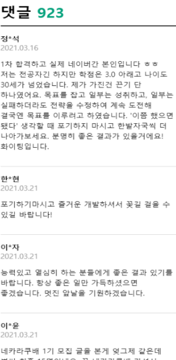

# 2021-09-11-Sat

<br/>

## HTML/CSS 연습 문제 풀기

<br/>

### 😺 1번 문제

<br/>

**👉 <코드>**

```html
<!DOCTYPE html>
<html lang="ko">
  <head>
    <meta charset="UTF-8" />
    <title>1번</title>
    <style>
      .content {
        border: 1px solid black; /* 검정색의 1px 실선 */
        /* box-sizing: content-box */
        width: 100px;
        height: 100px;
        margin: 10px 15px 20px 15px; /* 상 우 하 좌 */
        padding: 10px;
      }
    </style>
  </head>
  <body>
    <div class="content"></div>
  </body>
</html>
```

<br/>
<br/>

**👉 <결과>**


<br/>
<br/>
<br/>
<br/>

**👉 <한마디>**  
`box-sizing`의 default는 `content-box`이고,  
이는 따로 지정해주지 않아도 적용된 것을 확인할 수 있었다!  
`margin`과 `padding`은 값이 4개일 때,  
상-우-하-좌 순서로 적용된다는 점!

<br/>

_소요 시간은 2분(제한 3분)_
<br/>
<br/>
<br/>

### 😸 2번 문제

<br/>

**👉 <코드>**

```html
<!DOCTYPE html>
<html lang="ko">
  <head>
    <meta charset="UTF-8" />
    <title>2번</title>
    <style>
      .menu {
        border-bottom: 1px solid rgb(231, 231, 231);
        height: 64px;
        padding: 0 16px;
      }
      .title {
        display: inline;
        font-size: 24px;
        /* font-weight: bold; */
      }
      ul {
        display: inline;
        list-style-type: none;
      }
      .menu-item {
        display: inline;
        margin: 0 10px;
      }
    </style>
  </head>
  <body>
    <nav class="menu">
      <h1 class="title">네카라쿠배</h1>
      <ul>
        <li class="menu-item">로그인</li>
        <li class="menu-item">회원가입</li>
        <li class="menu-item">마이페이지</li>
      </ul>
    </nav>
  </body>
</html>
```

<br/>
<br/>

**👉 <결과>**


<br/>
<br/>
<br/>
<br/>

**👉 <한마디>**  
내비게이션을 알려주는 `<nav>` 태그 안에  
제목 요소와 순서 없는 목록 태그를 삽입해서 만들었다.  
`float: left`로 하는 게 맞는 것 같은데,  
뭔가 위치가 깨지는 것 같아서 일단은 모두 `inline`으로 지정하였다.  
다음 주에 모범 답안이 나오면 꼼꼼히 읽어보고 비교해 봐야지.

<br/>

_소요 시간은 9분(제한 7분)_  
한 줄에 어떻게 만들지 고민하다가 시간이 많이 갔다.

<br/>
<br/>
<br/>

<br/>

### 😹 3번 문제

<br/>

**👉 <코드>**

```html
<!DOCTYPE html>
<html lang="ko">
  <head>
    <meta charset="UTF-8" />
    <title>3번</title>
    <style>
      .container {
        width: 400px;
        display: grid;
        grid-template-columns: repeat(3, 1fr);
        grid-template-rows: repeat(3, 1fr);
      }
      img {
        border-radius: 1em;
        border: 1px solid black;
        width: 100px;
        height: 100px;
        margin: 15px;
      }
    </style>
  </head>
  <body>
    <div class="container">
      
      
      
      
      
      
      
    </div>
  </body>
</html>
```

<br/>
<br/>

**👉 <결과>**


<br/>
<br/>
<br/>
 
**👉 <한마디>**    
`grid`를 활용했는데, 이것저것 스타일이 섞여서   
grid간의 간격을 맞추기가 조금 힘들었다.

<br/>

이미지들의 url을 활용하여 `src` 속성에 지정했고,  
`grid-template-columns`/`grid-template-rows`로  
3 x 3 레이아웃처럼 만들었다.  
`border-radius`에 값을 지정하여 아이콘을 쪼꼼 둥글게 만들어주었다.

<br/>

_소요 시간은 9분(제한 10분)_

<br/>
<br/>
<br/>

### 😻 4번 문제

<br/>

**👉 <코드>**

```html
<!DOCTYPE html>
<html lang="ko">
  <head>
    <meta charset="UTF-8" />
    <meta name="viewport" content="width=device-width, initial-scale=1" />
    <title>4번</title>
    <style>
      @media (min-width: 720px) {
        header {
          display: inline-block;
          width: 70%;
        }
        section:first-child {
          display: inline-block;
          width: 70%;
          margin: 0;
        }
        aside {
          float: right;
          width: 25%;
          position: fixed;
          top: 0;
          right: 0;
        }
      }
      body {
        margin: 0;
        padding: 0;
      }
      header {
        background-color: blue;
        color: white;
        top: 0;
      }
      section {
        margin-bottom: 50px;
        margin-top: 50px;
      }
      li {
        border-bottom: 1px solid black;
        margin-bottom: 15px;
      }
    </style>
  </head>
  <body>
    <div class="container">
      <header>
        <h1>삼성전자</h1>
        <h4>종목코드: 005930</h4>
      </header>
      <main>
        <section>
          <article>
            <h3>회사소개</h3>
            <p>
              한국 및 CE, IM부문 해외 9개 지역총괄과 DS부문 해외 5개 지역총괄,
              Harman 등 241개의 종속기업으로 구성된 글로벌 전자기업임.
              세트사업에는 TV, 냉장고 등을 생산하는 CE부문과 스마트폰,
              네트워크시스템, 컴퓨터 등을 생산하는 IM부문이 있음.
              부품사업(DS부문)에서는 D램, 낸드 플래쉬, 모바일AP 등의 제품을
              생산하는 반도체 사업과 TFT-LCD 및 OLED 디스플레이 패널을 생산하는
              DP사업으로 구성됨.
            </p>
          </article>
        </section>
        <aside>
          <section>
            <h3>시가총액 순위</h3>
            <ol>
              <li>삼성전자</li>
              <li>SK하이닉스</li>
              <li>카카오</li>
              <li>삼성바이오로직스</li>
              <li>삼성전자우</li>
              <li>삼성SDI</li>
              <li>LG화학</li>
              <li>현대차</li>
              <li>셀트리온</li>
            </ol>
          </section>
        </aside>
      </main>
    </div>
  </body>
</html>
```

<br/>
<br/>

**👉 <결과>**


---


<br/>
<br/>
<br/>

**👉 <한마디>**  
사실 미디어쿼리를 이용해서 뭘 만들어본 적이 없어서 당황했다.  
그래서 MDN에서 미디어쿼리문 작성하는 방법부터 확인하고 따라해보았는데,  
일단은 모바일 디바이스 기반으로 하되  
최소 너비가 720px 이상이면 `시가총액 순위` 부분을 옆으로 가도록 만들었다.

<br/>

옆으로 가게 만드는 부분이 좀 힘들었는데,  
`<header>` 부분과 `회사소개` 부분에 상관없이  
우측에 딱 붙이는 방법에 대해 고민이 많았다.  
일단은 이 부분들을 `inline-block`으로 지정해두고,  
`시가총액 순위`를 `float: right`로 지정하여  
적당히 `margin`을 지정해서 비슷하게 만들긴 했는데  
어떻게 하는 것이 더 좋은 방법인지 궁금하다.

<br/>

실습하면서 `display` 속성 쓰는 게 아직 미숙하다 느껴졌고,  
`section`이나 `article` 같은 구조를 나타내는 요소들에 대한 개념과  
`inline`, `block`, `inline-block`에 대해서도  
머리로만 개념을 이해했지 상황에 따라서 잘 쓰지는 못한다고 느꼈다. 😅

<br/>

_소요 시간은 3..0..분(제한 20분)_

<br/>
<br/>
<br/>

### 😿 5번 문제

<br/>

**👉 <코드>**

```html
<!DOCTYPE html>
<html lang="ko">
  <head>
    <meta charset="UTF-8" />
    <meta http-equiv="X-UA-Compatible" content="IE=edge" />
    <meta name="viewport" content="width=device-width, initial-scale=1.0" />
    <title>5번</title>
    <style>
      body {
        margin: 0;
        padding: 0;
      }
      .container {
        width: device-width;
      }
      header {
        border-bottom: 2px solid black;
        margin: 5px;
      }
      .comment-title {
        display: inline;
        margin-right: 10px;
      }
      .comment-count {
        display: inline;
        color: #06a27d;
        font-size: 2em;
        font-weight: bold;
      }
      .comment-container {
        border-bottom: 1px solid rgb(209, 209, 209);
        box-sizing: border-box;
        padding: 18px 20px;
        width: 100%;
      }
      .comment-name {
        font-weight: bold;
      }
      .comment-date {
        color: #939393;
      }
      .comment-content {
        line-height: 1.5;
        margin-top: 20px;
        word-break: keep-all;
      }
    </style>
  </head>
  <body>
    <div class="container">
      <header>
        <h1 class="comment-title">댓글</h1>
        <p class="comment-count">923</p>
      </header>
      <main>
        <div class="comment-container">
          <div class="comment-name">정*석</div>
          <div class="comment-date">2021.03.16</div>
          <div class="comment-content">
            1차 합격하고 실제 네이버간 본인입니다 ㅎㅎ 저는 전공자긴 하지만
            학점은 3.0 아래고 나이도 30세가 넘었습니다. 제가 가진건 끈기 단
            하나였어요. 목표를 잡고 일부는 성취하고, 일부는 실패하더라도 전략을
            수정하여 계속 도전해 결국엔 목표를 이루려고 하였습니다. '이쯤 했으면
            됐다' 생각할 때 포기하지 마시고 한발자국씩 더 나아가보세요. 분명히
            좋은 결과가 있을거에요! 화이팅입니다.
          </div>
        </div>
        <div class="comment-container">
          <div class="comment-name">한*현</div>
          <div class="comment-date">2021.03.21</div>
          <div class="comment-content">
            포기하기마시고 즐거운 개발하셔서 꽃길 걸을 수 있길 바랍니다!
          </div>
        </div>
        <div class="comment-container">
          <div class="comment-name">이*자</div>
          <div class="comment-date">2021.03.21</div>
          <div class="comment-content">
            능력있고 열심히 하는 분들에게 좋은 결과 있기를 바랍니다. 항상 좋은
            일만 가득하셨으면 좋겠습니다. 멋진 앞날을 기원하겠습니다.
          </div>
        </div>
        <div class="comment-container">
          <div class="comment-name">이*윤</div>
          <div class="comment-date">2021.03.21</div>
          <div class="comment-content">
            네카라쿠배 1기 모집 글을 본게 엊그제 같은데 벌써 최종 15명이네요. 꼭
            네카라쿠배 가셔서 즐겁게 개발일 하시면 좋겠습니다! 앞으로의 길을
            응원해요. 저도 2기 지원할게요~!!
          </div>
        </div>
        <div class="comment-container">
          <div class="comment-name">박*호</div>
          <div class="comment-date">2021.03.21</div>
          <div class="comment-content">
            최종 15분이 멋진 길을 이뤄주시면 다음에 시도하시는 분들도 앞선
            지원자들을 보고 더욱 열심히 공부를 하며 동기부여가 될거라고
            생각합니다. 최선을 다하신것에 보답이라고 생각하시면서 꽃길만
            걸으시기 바랍ㄴ디ㅏ.
          </div>
        </div>
        <div class="comment-container">
          <div class="comment-name">김*성</div>
          <div class="comment-date">2021.03.21</div>
          <div class="comment-content">존버필승입니다 화이팅하십쇼</div>
        </div>
      </main>
    </div>
  </body>
</html>
```

<br/>
<br/>

**👉 <결과>**

<br/>

###### 🐤 원본 이미지

<br/>



<br/>

---

<br/>

###### 🐥 클론코딩 이미지

<br/>


<br/>
<br/>
<br/>
<br/>

**👉 <한마디>**  
클론코딩이라고 해서 사이트에서 직접 보고 따라해야되나 싶었지만,  
사실 그렇게 하면 도전해보는 재미가 없어서 그냥 생각나는 대로 했다.

<br/>

title 부분을 `<header>`로 지정하고, 나머지를 `<main>`으로 지정했다.  
각 댓글의 컨테이너를 `comment-container`로 묶어주고,  
이름 부분을 `comment-name`, 작성 날짜를 `comment-date`,  
댓글 내용을 `comment-content` 클래스로 지정했다.

<br/>

모바일 기반으로 만들어야 하는데, 그 기준을 잘 모르겠었다.  
`width`를 400px로 해야 하는지, 350px 쯤으로 해야 하는지...  
수치를 바꿔서 계속 실험해봤지만 오묘하게 여백이 남는다거나,  
글자가 짜부🌞된다거나 하는 현상이 발생.

<br/>

그러다가 탁!하고 든 생각이,  
`<meta name="viewport" content="width=device-width, initial-scale=1.0">`가  
`<head>` 태그 내에 작성되어 있었던 것에서...

<br/>

`width`를 `device-width`로 설정하면  
각 기기에 알맞게 표현되지 않을까? 라는 생각으로 한번 지정해봤는데,  
width가 기기의 너비를 잘 인식하고 그에 맞게 잘 표현되었다.  
device에 맞는 width를 잘 인식했는지는 개발자 도구에서 확인했다.

<br/>

_멋지게도 소요시간은 30분!(제한 20분)_  
🐛 참..잘했어요..! 🐛

<br/>
<br/>
<br/>
<br/>

### 🙌 **<마지막으로..>**

저번 HTML 연습 문제는 난이도가 어렵지 않아서  
모범 답안을 확인해도 크게 다르다거나 잘못 쓴 것 같다는 느낌은 없었는데  
이번 문제들은 모범답안과 나의 코드가 많이 다를 것 같다.  
뭔가 애매~하게 알고 있는 부분을 콕 찝어 지적당한 느낌이었다.

<br/>

항상 동기를 부여해주고 자극받고, 부족하다는 느낌을
지속적으로 받고 있는 이 상황이 전혀 싫지가 않다.  
나는 앞으로 더 노력해야하고, 더 치밀해져야 한다.

<br/>

역시 뭔가를 만들어서 눈으로 보는 건 신나는 일이다.  
근데 조금 더 잘해보자..!

<br/>
<br/>
