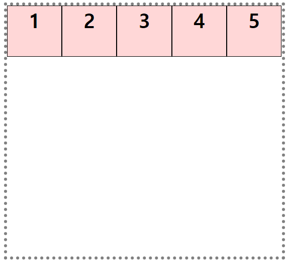
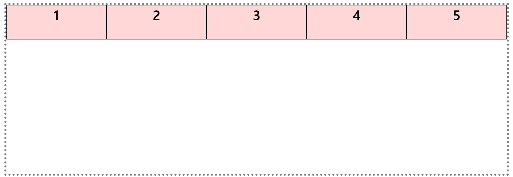
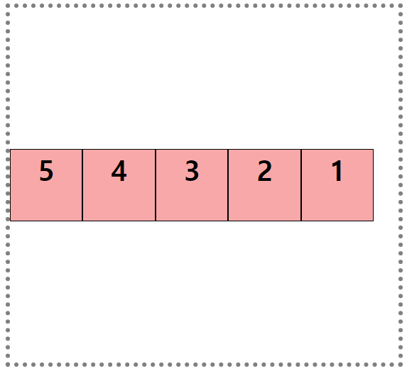
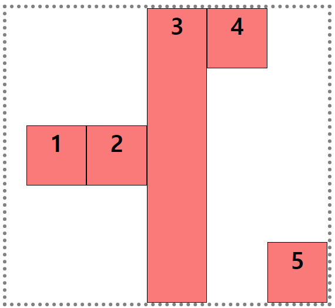
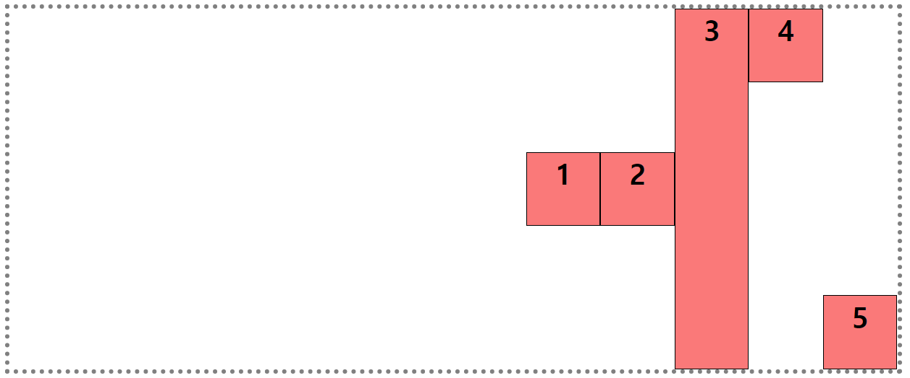

# 2021-09-13-Mon

<br/>

## 10. flexbox

### 🐶 개요

flexible box layout!  
요소를 **1차원적으로 정렬**한다.  
`inline-block`이나 `float: left`를 썼을 때  
따라오는 단점을 **`display: flex`** 로 커버할 수 있다.  
기본 여백이 생기지도 않으며,  
부모 컨테이너가 짜부되는 현상도 발생하지 않는다.  
사이트의 크기가 변경되어도 유동적으로 크기를 유연하게 만들면서  
아이템들의 정렬을 유지시킨다.

<br/>

이런 식으로 요소들을 정렬 가능케 하는 것이  
유연 상자(?) 레이아웃이다!  
**부모 컨테이너가 필요하고, 각각의 아이템들은 자식 요소여야 한다!**

<br/>
 
*`inline-block`과의 차이는 무엇일까?*   
`inline-block`은 `width`를 직접 지정해주어야 하는 반면    
`flex`는 자동으로 계산해준다!

<br/>
<br/>
<br/>

### 🐱 용어

⚡ `flex container` : 부모 컨테이너  
⚡ `flex item` : 내부 아이템들  
⚡ `main axis` : 주축  
⚡ `cross axis` : 교차축, 주축의 수직이 되는 축이다.

<br/>

_flex에 아무런 설정도 하지 않았다면_  
주축은 x축(좌->우), 교차축은 y축(상->하)이다.

<br/>
<br/>
<br/>

### 🐭 container

⚡ **display**  
 `block`, `inline`, `inline-block` 같은 경우는  
 해당 요소의 앞뒤와의 관계를 위해 설정했던 속성값인데, (`<display-outside>`)  
 `flex`, `grid`는 내부 자식 요소들의 레이아웃을 설정하기 위함이다. (`<display-inside>`)  
 이 둘을 혼용해서 **`display: inline-flex;`** 처럼 쓸 수 있다.  
 **display는 container에서 설정하는 것이다!**

<br/>

⚡ **flex-direction**  
 아이템을 배치할 주축과 방향(정방향/역방향)을 지정한다.  
 주축이 2가지, 방향이 2가지이므로 4가지 값을 설정 가능하다.  
 `row`, `row-reverse`, `column`, `column-reverse`!  
 `row`가 포함된 것은 x축이 주축이며, `column`은 그 반대이다.  
 `-reverse`가 포함된 것은 시작점과 끝점이 역전된다.

<br/>

⚡ **flex-wrap**  
 **강제로 한 줄에 배치할지, 여러 행(또는 여러 열)으로 배치할지를 결정**한다!  
 개인적으로는 약간 `overflow: hidden/visible` 같은 느낌이었다.  
 기본값은 강제로 한줄에 배치되게 하는 **`nowrap`** 이다.  
 하지만 지정 width보다 유동적으로 변하는 것이 단점이 될 수 있다.  
 여러 줄에 걸쳐 배치하는 것은 **`wrap`** 이다.  
 시작점과 끝점의 기준을 반대로 바꾸는 것은 **`wrap-reverse`** 이다!

<br/>

⚡ **flex-flow (shorthand)**
위의 `flex-direction`과 `flex-wrap`을 모두 쓸 수 있는 *단축 속성*이며,  
각각을 spacing으로 구분하여 쓰면 된다.

<br/>
<br/>
<br/>

### 🐹 item

⚡ **order _(initial: 0)_**  
 각 아이템의 배치 순서를 지정한다.  
 기본값인 0을 따르면 코드 순서대로 배치된다.  
 **정수를 사용**할 수 있으며,  
 앞으로 보이고 싶을 수록 작은 수를 쓴다.  
 _탭 순서와는 상관 없고 시각적인 효과만_ 준다!

<br/>

⚡ **flex-grow _(initial: 0)_**  
 컨테이너 너비 내에서 수용할 공간이 남으면  
 나누어서 각 요소들에게 준다.  
 동일한 `flex-grow`를 설정하면 균등하게 공간을 부여받는다.  
 이 속성값이 요소별로 다르다면 비율 별로 부여 받는다!

<br/>

⚡ **flex-shrink _(initial: 1)_**  
 `flex-grow`와 유사하지만, `flex-shrink`는 **줄어드는 개념**이다.  
 item들의 크기가 컨테이너보다 클 때 사용 가능하다.  
 컨테이너의 width를 줄이고 item의 크기가 더 크도록 만들면,  
 기본값이 1이므로 flex 아이템들의 width가 자동으로 줄어들었었는데,  
 `flex-shrink: 0;`으로 설정해주면 item의 width가 자동으로 줄어들지 않고  
 마치 `min-width`를 가지고 있는 것처럼 보여진다.

<br/>

⚡ **flex-basis**  
 아이템의 초기 크기를 지정한다.  
 (grow, shrink 둘 다 아닌 상태를 뜻한다.)

1.  직접 `flex-basis`의 크기를 지정해주면,  
    `flex-grow`는 늘어난 만큼의 크기만큼 비율을 나누어 요소에게 주고,
2.  그게 아니라 `flex-basis`를 0으로 설정하면,  
    초기 크기 자체가 `flex-grow`의 비율만큼 보이게 된다.

<br/>

⚡ **flex (shorthand) _(initial: `flex: 0 1 auto`)_**  
 initial 값은 `flex-grow: 0`, `flex-shrink: 1`, `flex-basis: auto`이다.  
 _flex-basis는 그러나 작성하지 않는다고 해서 auto라는 initial로 지정되지 않는다._

<br/>

값이 하나일 때, `<number>`를 쓰면 `flex-grow`를 지정하는 것이고,  
`<length>`, `<percentage>`를 쓰면 `flex-basis`가 된다.  
한 개 또는 두 개의 단위 없는 숫자를 사용하면 `flex-basis`가 `auto`가 아닌 0이 된다.

<br/>

값이 두개일 때, 첫번째 값은 무조건 `<number>`인 `flex-grow`로 지정된다.  
두 번째 값이 단위가 없다면 `flex-shrink`, 있다면 `flex-basis` 값으로 인식한다.

<br/>

값이 세 개일 때, `flex-grow`, `flex-shrink`, `flex-basis` 순으로 지정된다.

<br/>
<br/>
<br/>

### 🐰 정렬 관련!

#### ⭐ container

⚡ **justify-content**  
 주축을 기준으로 아이템을 어떻게 정렬할지 정한다!  
 `flex-start`는 주축이 시작되는 위치,  
 `flex-end`는 주축이 끝나는 위치를 기준으로 정렬한다.  
 `center`는 주축 기준으로 가운데에 정렬한다.  
 `space-between`은 처음 요소와 마지막 요소를 여백없이 배치하고, 나머지 요소의 간격을 동일하게 배치한다.  
 `space-around`는 각 요소 앞뒤로 같은 간격을 두고 배치한다.

<br/>

⚡ **align-items _(initial: stretch)_**  
 교차축에 대한 정렬을 정의한다.  
 `justify-content`가 한 줄 내에서 요소의 정렬이었다면  
 `align-items`는 한 줄 자체의 위치를 배치한다.

<br/>

⚡ **align-content**  
 `align-items`는 한 줄 자체의 위치를 배치했는데,  
 `flex-wrap` 등을 설정해서 flex가 여러 줄일때  
 그 줄들을 교차축에 대해 배치하는 방법을 지정한다.

<br/>

#### ⭐ item

⚡ **align-self**  
 하나의 아이템에 따로 배치를 지정할 수 있다.

<br/>
<br/>
<br/>

### ❗ 실습해보자 ❗

```html
<!DOCTYPE html>
<html lang="ko">
  <head>
    <meta charset="UTF-8" />
    <meta http-equiv="X-UA-Compatible" content="IE=edge" />
    <meta name="viewport" content="width=device-width, initial-scale=1.0" />
    <title>실습</title>
    <style>
      .container {
        border: 5px dotted grey;
        height: 400px;
        display: flex;
        margin: 10px;
      }
      .container div {
        width: 80px;
        height: 80px;
        font-size: 2em;
        font-weight: bold;
        text-align: center;
      }
      .one {
        flex-wrap: nowrap;
      }
      .one div {
        background-color: rgb(255, 215, 215);
        border: 1px solid black;
        flex: 1;
      }
      .two {
        flex-flow: row-reverse wrap;
        justify-content: flex-end;
        align-items: center;
      }
      .two div {
        background-color: rgb(248, 168, 168);
        border: 1px solid black;
        flex-shrink: 0;
      }
      .three {
        flex-wrap: wrap;
        justify-content: flex-end;
        align-items: center;
      }
      .three div {
        background-color: rgb(250, 121, 121);
        border: 1px solid black;
      }
      .three .item-3 {
        height: auto;
        align-self: stretch;
      }
      .three .item-4 {
        align-self: baseline;
      }
      .three .item-5 {
        align-self: flex-end;
      }
    </style>
  </head>
  <body>
    <div class="container one">
      <div class="item-1">1</div>
      <div class="item-2">2</div>
      <div class="item-3">3</div>
      <div class="item-4">4</div>
      <div class="item-5">5</div>
    </div>
    <div class="container two">
      <div class="item-1">1</div>
      <div class="item-2">2</div>
      <div class="item-3">3</div>
      <div class="item-4">4</div>
      <div class="item-5">5</div>
    </div>
    <div class="container three">
      <div class="item-1">1</div>
      <div class="item-2">2</div>
      <div class="item-3">3</div>
      <div class="item-4">4</div>
      <div class="item-5">5</div>
    </div>
  </body>
</html>
```

<br/>
<br/>

##### 💛 첫 번째 flexbox




<br/>

`flex: 1`과 `flex-wrap: nowrap`을 설정한 flex!  
늘이거나 줄여도 한줄에만 배치되며, `width`가 자동 설정된다.

<br/>

---

<br/>

##### 💛 두 번째 flexbox



<br/>

주축의 정렬은 `flex-end`, 교차축의 정렬은 `center`인 flex!  
방향을 `row-reverse`로 설정하여 순서가 역전되었고,
`flex-start`와 `flex-end`가 가리키는 기준점도 뒤바뀌었다.

<br/>

---

<br/>

##### 💛 세 번째 flexbox




<br/>

주축/교차축의 정렬이 두 번째 flexbox와 같다.  
하지만 3번째 item에 `align-self: stretch`와  
4번째 item에 `align-self: flex-start`,  
5번째 item에 `align-self: flex-end`를 지정해봤다.

<br/>

처음에 적용이 되지 않아서 답답했는데,  
`align-content`를 컨테이너 속성에서 지워주니 잘 동작했다.

<br/>
<br/>
