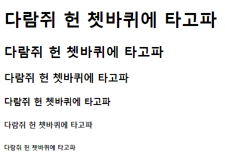
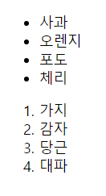
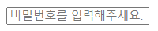
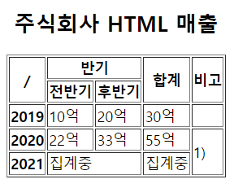
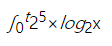

# 2021-09-05-Sun

<br/>

## HTML 연습 문제 풀기

<br/>

### 😺 1번 문제

<br/>

**👉 <코드>**

```html
<!DOCTYPE html>
<html lang="ko">
  <head>
    <meta charset="UTF-8" />
    <title>1번</title>
  </head>
  <body>
    <h1>다람쥐 헌 쳇바퀴에 타고파</h1>
    <h2>다람쥐 헌 쳇바퀴에 타고파</h2>
    <h3>다람쥐 헌 쳇바퀴에 타고파</h3>
    <h4>다람쥐 헌 쳇바퀴에 타고파</h4>
    <h5>다람쥐 헌 쳇바퀴에 타고파</h5>
    <h6>다람쥐 헌 쳇바퀴에 타고파</h6>
  </body>
</html>
```

<br/>
<br/>

**👉 <결과>**



<br/>
<br/>

**👉 <한마디>**  
제목 태그의 뒤 숫자에 따라  
폰트 크기가 달라지는 점을 인지하였다.  
_하지만 폰트 굵기나 크기를 위해 `<hn>` 태그 사용은 지양할 것!_

<br/>
<br/>
<br/>

### 😸 2번 문제

<br/>

**👉 <코드>**

```html
<!DOCTYPE html>
<html lang="ko">
  <head>
    <meta charset="UTF-8" />
    <title>2번</title>
  </head>
  <body>
    <ul>
      <li>사과</li>
      <li>오렌지</li>
      <li>포도</li>
      <li>체리</li>
    </ul>
    <ol>
      <li>가지</li>
      <li>감자</li>
      <li>당근</li>
      <li>대파</li>
    </ol>
  </body>
</html>
```

<br/>
<br/>

**👉 <결과>**



<br/>
<br/>

**👉 <한마디>**  
`ul`은 _unordered list_, `ol`은 _ordered list_,  
그리고 `li`는 그들의 항목(item)이라는 점을 활용하여  
**비정렬/정렬 리스트**를 써 보았다.

<br/>
<br/>
<br/>

<br/>

### 😹 3번 문제

<br/>

**👉 <코드>**

```html
<!DOCTYPE html>
<html lang="ko">
  <head>
    <meta charset="UTF-8" />
    <title>3번</title>
  </head>
  <body>
    <form>
      <input
        type="password"
        minlength="6"
        maxlength="20"
        placeholder="비밀번호를 입력해주세요."
      />
    </form>
  </body>
</html>
```

<br/>
<br/>

**👉 <결과>**



<br/>
<br/>
 
**👉 <한마디>**  
`input` 요소의 최소/최대 길이를 설정하고,  
`placeholder` 속성으로 힌트를 주었다.  
또한 `type`을 **`password`** 로 지정하여 마스킹되도록 하였다.

<br/>
<br/>
<br/>

### 😻 4번 문제

<br/>

**👉 <코드>**

```html
<!DOCTYPE html>
<html lang="ko">
  <head>
    <meta charset="UTF-8" />
    <title>4번</title>
  </head>
  <body>
    <table border="1">
      <caption>
        <h2>주식회사 HTML 매출</h2>
      </caption>
      <thead>
        <tr>
          <th rowspan="2">/</th>
          <th colspan="2">반기</th>
          <th rowspan="2">합계</th>
          <th rowspan="2">비고</th>
        </tr>
        <tr>
          <th>전반기</th>
          <th>후반기</th>
        </tr>
      </thead>
      <tbody>
        <tr>
          <th>2019</th>
          <td>10억</td>
          <td>20억</td>
          <td>30억</td>
          <td></td>
        </tr>
        <tr>
          <th>2020</th>
          <td>22억</td>
          <td>33억</td>
          <td>55억</td>
          <td rowspan="2">1)</td>
        </tr>
        <tr>
          <th>2021</th>
          <td colspan="2">집계중</td>
          <td>집계중</td>
        </tr>
      </tbody>
    </table>
  </body>
</html>
```

<br/>
<br/>

**👉 <결과>**



<br/>
<br/>

**👉 <한마디>**  
기본적인 `table`과 `tr`, `td` 생성을 했고,  
`colspan`, `rowspan`을 활용하였다.  
그리고 `caption`을 삽입하여 표를 요약 설명할 수 있었다.  
`thead`, `tbody`도 적용하여 접근성을 위한 연습도 해 보았다!

<br/>
<br/>
<br/>

### 😿 5번 문제

<br/>

**👉 <코드>**

```html
<!DOCTYPE html>
<html lang="ko">
  <head>
    <meta charset="UTF-8" />
    <title>5번</title>
  </head>
  <body>
    <i>∫</i><sub>0</sub><sup><var>t</var></sup
    >2<sup>5</sup>×<var>log</var><sub>2</sub>x
  </body>
</html>
```

<br/>
<br/>

**👉 <결과>**



<br/>
<br/>

**👉 <한마디>**  
`sup`과 `sub`을 활용하여 위첨자/아래첨자를 표현하였고,  
변수를 알리는 `<var>` 요소도 활용하였다.  
또한 `<i>` 요소로 기울임체도 표시하였다.  
해당 태그들의 역할을 인지하여 올바르게 써 보는 연습을 하였다.

<br/>
<br/>
<br/>

### 🙌 **<마지막으로..>**

대부분의 문제가 제한 시간보다는 시간을 덜 소요했지만,  
주어진 문제를 빠르고 정확하게, 그리고 가이드에 맞게 수행하는 것이 중요하므로  
왜 이 태그를 선택했는지, 역할게 맞게 요소를 활용하였는지  
항상 숙고하여 코드를 작성하는 것이 좋겠다고 느꼈다.
