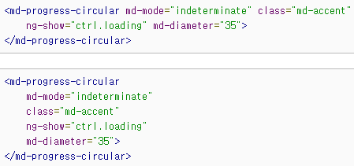
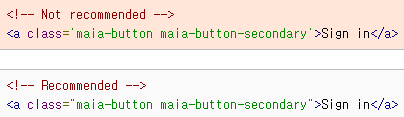

# 2021-09-06-Mon

<br/>

## HTML 스타일 가이드 번역하고 공부하기

HTML을 꽤 자주 공부했다고 생각했지만,  
자주 쓰이는 태그들만의 용례를 알 뿐 스타일 가이드에 대해서는 무지했던 탓에  
구글의 HTML/CSS 스타일 가이드를 보고 번역하며 공부하기로 했다.

<br/>

사실 한국어로 번역해서 볼까 했는데, 영어 공부한다는 생각으로.  
언젠가는 익숙해져야 할 일이니, 어렵더라도 열심히 해보기로 했다.

<br/>

> https://google.github.io/styleguide/htmlcssguide.html

<br/>
<br/>

### 🐣 일반 규칙

<br/>

**⚡ 1. 리소스에 프로토콜을 생략하지 않는 것을 권장한다.**

```html
❌
<script src="zero-base.co.kr"></script>
```

```html
⭕
<script src="https://zero-base.co.kr"></script>
```

<br/>
<br/>

**⚡ 2. 한 번에 2번의 들여쓰기를 하지만, 탭과 스페이스 바를 혼용하지 말 것.**

<br/>
<br/>

**⚡ 3. 대소문자 구분을 하지 않지만, 모든 코드를 소문자로만 사용할 것.**

```html
❌
<h1 class="ZERO"></h1>
```

```html
⭕
<h1 class="ZERO"></h1>
```

<br/>

신기한 점은, `color: #FFFFEE"` 같은 코드도  
`color: #ffffee`로 쓰도록 권장했다는 점이다.  
아예 몰랐던 부분이라 숙지!

<br/>
<br/>

**⚡ 4. 인코딩을 `<meta charset="utf-8">`과 같이 유니코드로 지정하라.**

<br/>
<br/>

**⚡ 5. 필요할 경우 주석을 사용하여 코드를 설명하라.**

<br/>
<br/>

**⚡ 6. TODO를 사용하여 할 일, 작업 내용을 표시하라.**

```html
<!-- TODO(soya): 할 일 -->
```

<br/>
<br/>
<br/>
<br/>

### 🐤 HTML 규칙

<br/>

**⚡ 1. HTML5를 사용하라!**  
그러기 위해서, `<!DOCTYPE html>`를 사용한다.  
빈 요소(`br`)를 `<br/>`로 쓰지 말 것!  
(그래서..이제 마크다운 문서에서도 `<br>`을 쓰기로 했다..) 💦

<br>
<br>

**⚡ 2. 유효한 HTML을 사용하라!**

> https://validator.w3.org/nu/#textarea

<br/>

에서 유효성 검사를 할 수 있으니,  
문서를 작성하고 유효성 검사를 하는 편이 좋다고 한다.

<br/>
<br/>

**⚡ 3. 목적에 맞는 HTML 태그를 사용하라.**

```html
❌
<div onclick="click();"></div>
```

```html
⭕ <button onclick="click();"></button>
```

div는 본래 클릭 이벤트에 반응하기 위한 요소가 아니므로,  
`<a>` 태그나 `<button>` 요소를 사용하라는 내용이었다.

<br/>
<br/>

**⚡ 4. 멀티미디어의 대체 컨텐츠를 제공하라.**  
대체 컨텐츠란 아래와 같은 기능을 말한다.

```html

```

즉 이미지로 가정하면 `alt` 속성을 이용하여  
정상적으로 표시되지 않았을 때를 대비하고,  
스크린 리더 사용자를 위하라는 것이다.

<br/>
<br/>

**⚡ 5. HTML/CSS/JavaScript를 분리해라.**  
이 분리하라는 말은, HTML 파일에서 내장 스타일을 적용하는 것,  
또 이것들을 혼용하는 것 등과 같다.  
예시를 작성해보자.

```html
❌
<link rel="stylesheet" href="zerobase.css" />
<h1 style="font-weight: bolder;">This is h1 tag</h1>
<button onclick="click();"></button>
<script src="zerobase.js"></script>
```

```html
⭕
<link rel="stylesheet" href="zerobase.css" />
<h1>This is h1 tag</h1>
<script src="zerobase.js"></script>
```

즉, 되도록 HTML 파일에는 HTML, CSS 파일에는 CSS만 사용하도록 하여  
세 파일 간의 상호작용을 최소한으로 줄이는 것이 좋다는 내용이다.  
나쁜 예를 보니 확실히 가독성 면에서도 보기 좋지 않았다.

<br/>
<br/>

**⚡ 5. 어쩔 수 없는 경우를 제외한 `entity` 사용을 지양하자.**

```html
❌
The currency symbol for the Euro is &ldquo;&eur;&rdquo;.
```

<br/>

`<`이나 `&`과 같이 의미가 있으면서 어쩔 수 없는 엔티티 말고,
이런 경우는 그냥 엔티티 부분을 `“€”`와 같이 쓰라고 권장한다.

<br/>
<br/>

**⚡ 6. `type` 속성을 생략하라.**
물론 이것은 `input` 태그와 같은 경우에서가 아니라,  
CSS 파일이나 JavaScript 파일을 불러올 때의 경우이다.

```html
❌ <link rel="stylesheet" href="zerobase.css" type="text/css" />
```

```html
⭕ <link rel="stylesheet" href="zerobase.css" />
```

그 이유는 HTML5에서는 `text/css`, `text/javascript` 속성이 기본이라,  
굳이 적어주는 것이 불필요하다고 한다.

<br/>
<br/>

**⚡ 7. 매 블록, 리스트, 테이블 요소의 자식들은 들여써라.**

```html
⭕
<ul>
  <li>사과</li>
  <li>바나나</li>
  <li>토마토</li>
  <li>포도</li>
</ul>

⭕
<table>
  <tr>
    <td>1</td>
    <td>2</td>
    <td>3</td>
  </tr>
  <tr>
    <td>4</td>
    <td>5</td>
    <td>6</td>
  </tr>
</table>
```

<br/>
<br/>

**⚡ 8. 줄바꿈은 가독성을 고려하여 하라.**



<br/>
<br/>

나의 VScode에서는 prettier 때문에 자동으로 줄바꿈이 보기 좋게 설정되어서,
사진을 첨부하여 숙지하기로 했다.  
prettier 사용은 물론 좋지만, 입문/초급 단계에서는  
작성 습관을 들이기 위해 사용하는걸 권장하지 않는다고 한다.

<br/>
<br/>

**⚡ 9. 따옴표는 쌍따옴표를 써라!**
속성값을 감쌀 때, 홀따옴표 보다는 쌍따옴표를 (일관적으로) 쓰기를 권장한다.



<br/>
<br/>

~~이것도 prettier 덕에 default가 쌍따옴표라  
홀따옴표와 쌍따옴표를 혼용할 경우는 없겠지만..~~

<br/>
<br/>
<br/>
<br/>

### 🐔 CSS 규칙

<br/>

**⚡ 1. HTML과 마찬가지로, CSS 유효성 검사를 하라!**

> https://jigsaw.w3.org/css-validator/

<br/>

와 같은 좋은 사이트가 있다고 하니..  
하라는 대로 해보면 좋겠다. 😄

<br/>
<br/>

**⚡ 2. 의미있거나 일반적인 ID와 class 이름을 써라.**

```css
❌ #soya {
}
```

```css
⭕ .login {
}
```

<br/>
<br/>

**⚡ 3. ID와 class 이름을 최대한 줄이되, 필요한 만큼은 포함하라.**
너무 짧아서 알아보기 힘든 단어가 있으면 안된다는 뜻인듯 하다.

```css
❌ #navigation {
  .atr {
  }
}
```

```css
⭕ #nav {
  .author {
  }
}
```

<br/>

라는 예시가 나와 있었다.  
atr만 보고는 author라고 단정짓기 힘드므로,  
줄이는 것은 좋지만 이해할 수 있을 정도로 쓰라는 것 같다.

<br/>
<br/>

**⚡ 4. 조상 선택자를 쓸데없이 포함하지 말라.**

```css
❌ ul#id {
  a.author {
  }
}
```

```css
⭕ #id {
  .author {
  }
}
```

<br/>

id와 클래스는 어차피 요소를 특정할 수 있는 속성이므로,  
조상 선택자를 불필요하게 사용하지 말라는 것이다.

<br/>
<br/>

**⚡ 5. 가능하면 줄인 속성을 써라.**
줄인 속성이란,  
`margin-top`, `margin-left` 등을 통틀어 `margin`으로 쓰는 것과,  
`font-weight`, `font-family` 등을 `font`로 쓰는 것을 말한다.

```css
❌
margin-top: 1em;
margin-bottom: 2em;
font-weight: thin;
font-size: 3em;
```

```css
⭕
margin: 1em auto 2em auto;
font: thin 3em;
```

<br/>
<br/>

**⚡ 6. 필요한 경우가 아니면 0 뒤에 단위를 생략하라.**

```css
❌
margin: 0px;
```

```css
⭕
margin: 0;
```

<br/>
<br/>

**⚡ 7. 0.~와 같은 속성값의 0을 생략하라.**

```css
❌
font-size: 0.7em;
```

```css
⭕
font-size: .7em;
```

<br/>
<br/>

**⚡ 8. 3글자 16진수 표기법을 사용하라.**

```css
❌
color: #ffeeaa;
```

```css
⭕
color: #fea;
```

<br/>
<br/>

**⚡ 9. ID와 class 이름을 이을 때, 언더바(\_)가 아닌 하이픈(-)을 이용하라.**

```css
❌
.gradeaverage
```

```css
❌
.grade_average
```

```css
⭕
.grade-average
```

나도 CSS의 ID, class 이름을 지을 때  
기분따라 이름에 언더바를 쓰기도 하고, 낙타 표기법을 쓰기도 했는데  
이 스타일 가이드를 보고 하이픈을 사용하는 것이 권장됨을 알았다.  
찾아서 읽어보지 않았으면 몰랐을 정보가 굉장히 많다.

<br/>
<br/>

**⚡ 10. 알파벳 순으로 선언하라.**

```css
⭕
background: black;
border: 1px solid grey;
color: white;
margin: 0 auto;
padding: 30px;
text-align: center;
```

위와 같이 하나의 요소(클래스)에 대한 선언을 할 때,  
읽거나 다시 찾기 쉽도록 알파벳 순으로 선언하는 것을 권장한다.

<br/>
<br/>

**⚡ 11. 매 선언마다 semicolon(;)을 사용한다.**

```css
❌
font-size: 2em;
font-weight: 800
```

```css
⭕
font-size: 2em;
font-weight: 800;
```

<br/>
<br/>

**⚡ 12. 속성 이름의 콜론 뒤에는 한 칸의 여백을 둔다.**

```css
❌
color:#efc;
```

```css
⭕
color: #efc;
```

<br/>
<br/>

**⚡ 13. 규칙 간에는 새로운 줄로 줄바꿈한다.**

```css
body {
  background: black;
  color: white;
  margin: 0;
}

p {
  font-size: 30px;
}
```

<br/>
<br/>

**⚡ 14. 규칙 간의 그룹을 주석으로 묶어 표현한다.**

```css
/* Header */
header {
  background: grey;
}

/* Body */
body {
  background: black;
  color: white;
  margin: 0;
}

table {
  font-size: 30px;
}

/* Footer */
footer {
  margin: 0;
}
```

<br/>
<br/>
<br/>
<br/>

### 🙌 **<마지막으로..>**

테스트를 보는데 스타일 가이드에 대한 문제를  
당연하게 오답으로 선택해서 낸 경험이 여러번 있어서,  
스타일 가이드에 대해서 제대로 인지해야겠다는 생각으로 시도한 번역 + 예제 공부.

<br/>

쉽지는 않았지만, 엉덩이 붙히고 앉아서 하니 그렇게 어렵지도 않았던.  
또, 어렵지는 않지만 모르고 아무렇게나 썼던 내 과거의 요소들에게 애도를 표한다...💦  
가이드 한 번 읽지 않고 그때그때 기분따라 다른 문서를 작성했던 나를 반성한다.  
앞으로는 오늘 공부한 내용을 바탕으로 스타일 가이드라인에 맞춰서  
일관적이고 멋진 문서를 만들길 바라며! 🖐

<br/>
<br/>
