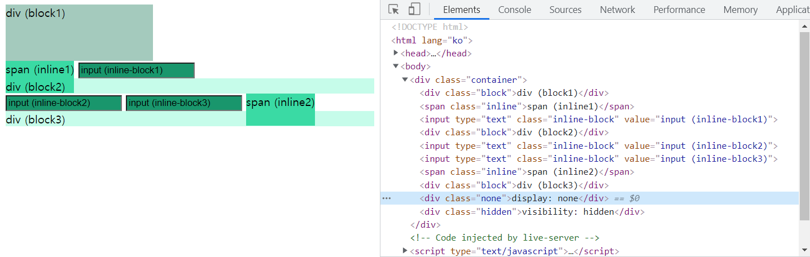
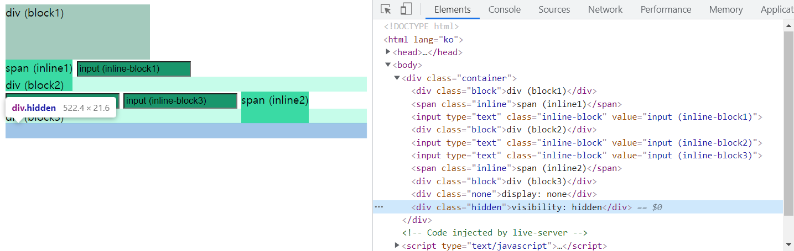
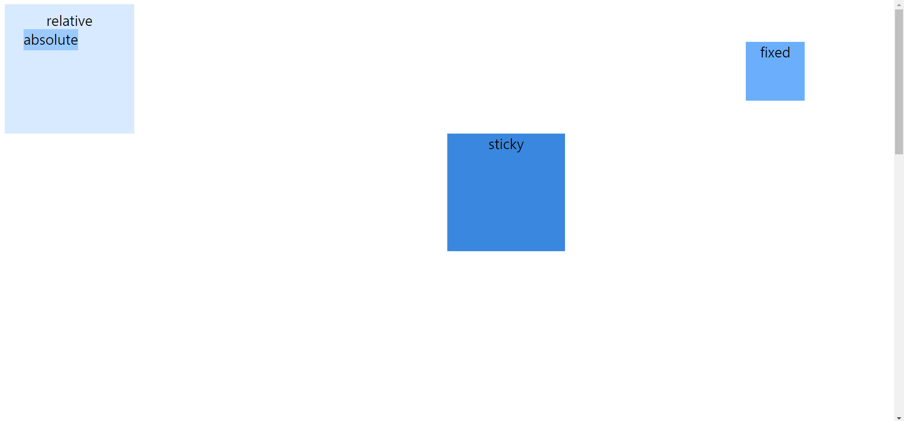
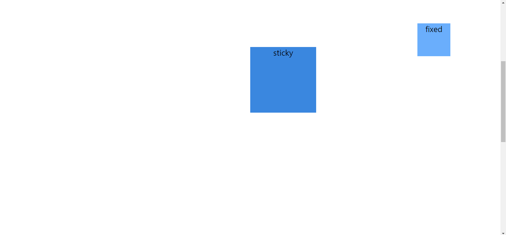

# 2021-09-09-Thu

<br/>

## 6. 레이아웃

### 🐘 display - inline, block, inline-block

요소들은 기본적으로 inline 요소인지, block 요소인지에 대해  
각자의 초깃값을 가지고 있다.  
이 값을 `display` 속성으로 변경해줄 수 있다.

**- inline 요소** : ex) `span`  
영역의 크기가 내부 콘텐츠 크기로 결정  
 `margin`, `padding`의 top/bottom을 설정 불가  
 여러 요소가 가로 배치가 됨!

<br/>

**- block 요소** : ex) `div`  
영역의 크기를 `width`, `height`로 지정  
 `width`를 미지정시 가로 전체 차지  
 여러 요소가 세로 배치가 됨!

<br/>

**- inline-block 요소** : ex) `input`  
영역의 크기를 `width`, `height`로 지정할 수 있고 `margin` 지정도 가능하다.  
여러 요소가 흐름에 따라 가로 배치가 됨

<br/>
<br/>
<br/>

### 🦛 요소를 없애는 방법 - display none, visibility hidden

`display: none`은 코드 상에는 존재하지만 레이아웃에는 배치되지 않는다.  
`visibility: hidden`은 레이아웃에는 포함되지만 눈에 보이지 않게만 한다.  
둘 중 무엇을 사용할지, 각각의 특징을 잘 파악하여 고려해야겠다.

<br/>
<br/>
<br/>

### ❗ 실습해보자 ❗

```html
<!DOCTYPE html>
<html lang="ko">
  <head>
    <meta charset="UTF-8" />
    <title>실습</title>
    <style>
      .container {
        height: 400px;
      }
      .block {
        background-color: rgb(198, 252, 234);
      }
      .inline {
        background-color: rgb(58, 218, 164);
        margin-top: 2em; /* 적용되지 않는다. */
        padding-bottom: 1.5em; /* 적용되지 않아 밀려나지 않는다. */
        /* https://medium.com/@DaphneWatson/
      css-display-properties-block-inline-and-inline-block
      -how-to-tell-the-difference-7d3a1e6e3051 */
      }
      .inline-block {
        background-color: rgb(25, 150, 108);
      }
      .block:first-of-type {
        background-color: rgb(164, 202, 189);
        width: 40%;
        height: 20%;
        /* 가장 가까운 조상 블록 요소를 컨테이닝 블록으로 삼는다. */
        /* 그 위치에서 상대적인 비율을 백분율로 계산한다. */
        /* https://developer.mozilla.org/ko/docs/Web/CSS/Containing_block */
      }
      .none {
        display: none;
      }
      .hidden {
        visibility: hidden;
      }
    </style>
  </head>
  <body>
    <div class="container">
      <div class="block">div (block1)</div>
      <span class="inline">span (inline1)</span>
      <input type="text" class="inline-block" value="input (inline-block1)" />
      <div class="block">div (block2)</div>
      <input type="text" class="inline-block" value="input (inline-block2)" />
      <input type="text" class="inline-block" value="input (inline-block3)" />
      <span class="inline">span (inline2)</span>
      <div class="block">div (block3)</div>
      <div class="none">display: none</div>
      <div class="hidden">visibility: hidden</div>
    </div>
  </body>
</html>
```

<br/>
<br/>

##### 🚩 `inline`, `block`, `inline-block` 요소 실습 +

**normal flow와 사용 가능한 속성, 적용되지 않는 속성 등을 알아 보았다.**  
생각보다 복잡하고 굉장히 어려운 ⚠ 실습이었다.  
그렇기 때문에 MDN에서 세부 사항들을 찾아보았다.

<br/>

또한 `span` 태그에서 `padding-top`, `padding-bottom`은  
적용되지 않는다고 배웠는데, 적용이 되는 것처럼 보여서  
학습 매니저님께 질문을 드렸다.

<br/>

껍데기만 적용된 것처럼 보일 뿐, 실제로 `padding`이 작용하는  
'inline 요소 내부 컨텐츠가 밀려난다'는 현상이 없음을 확인했다.  
원래라면 normal flow의 위치에서 `padding-top`을 적용하면  
그 자리에서 컨텐츠가 아래로 밀려나줘야 하는데,  
컨텐츠 자체는 제자리에 있고 여백 부분만 컨텐츠 위에 적용이 되는 것을 보고  
이것이 정상적으로 `padding-top`이 적용됨이 아니라는 것을 깨달았다.  
실습은 `padding-bottom`으로 바꾸어서도 해보며 확인했다!

<br/>
<br/>
<br/>

##### 🚩 `display: none`과 `visibility: hidden`도 실습 해보았다.

**1) `display: none`일 때는 개발자 도구 코드 상에 보이지만, 레이아웃에서 제외 되었다.**



<br/>
<br/>
<br/>

**2) `visibility: hidden`일 때는 개발자 도구 코드 상에 보이고,**  
**레이아웃에서도 존재하지만 요소가 눈에 보이지만 않는다.**



<br/>
<br/>
<br/>
<br/>

### 🦏 float

기존의 블록이 갖고 있던 특징을 무시하고 별도의 배치를 하도록 한다.  
그 뒤의 요소 위에 붕~떠있는(floating) 느낌을 준다.

<br/>
<br/>
<br/>

### 🐪 position과 Normal Flow

`position` 속성의 값인 `relative`, `absolute`, `fixed`, `sticky`를 알아보기 전에  
`Normal Flow`에 대해서 잘 이해하는 것이 좋은데,  
요소마다 각 `display`의 초깃값을 가지고 있고,  
이에 따라 초기 상태에서 문서가 어떻게 배치될 지를 알아야 한다.  
이 배치 상태를 **문서의 흐름, `노말 플로우`** 라고 한다.

<br/>
<br/>
<br/>

### 🐫 position- relative, absolute, fixed , sticky

**`relative`** - 자기 자신을 기준으로 이동하며,  
top, left, bottom, right 속성을 쓸 수 없다.

<br/>

**`absolute`** - 레이아웃에 배정하지 않고, Normal Flow에서 제거한다.  
가장 가까우면서 `position`이 `static`이 아닌 조상 요소의 상대적 위치로 배치한다.  
가장 가까운 조상 요소의 `position`이 `static`이라면  
다음으로 가까운 조상 요소(body도 가능)를 찾는다.  
보통 기준점을 잡고 싶은 조상 요소에 `position: relative`를 지정한다.

<br/>

**`fixed`** - Normal Flow에서 제거되고, 레이아웃에 배정하지 않는다.  
뷰포트의 초기 컨테이닝 블록(body)을 기준으로 배치한다.  
즉 기준점이 `body이다`. 위치는 `top`, `left`, `bottom`, `right`으로 조정한다.  
스크롤을 해도 뷰포트에서 고정되어있고, 이것이 가장 큰 특징이다.  
메뉴바, top버튼 등에 유용하다.

<br/>

**`sticky`** - 어느 시점에 도달했을 때 `fixed`처럼 동작하게 할 수 있다.  
스크롤되는 조상의 자식요소여야 하므로,  
보통 `body`의 직속 자식 요소인 요소를 `sticky`로 지정해야 동작한다.  
**Normal Flow에 따라 배치한다.**

<br/>
<br/>
<br/>

### 🦒 overflow

컨텐츠의 크기보다 내용이 많을 때 지정해주는 속성이다.  
기본은 `visible`이다.  
`hidden`으로 설정하면 넘치는 부분이 보이지 않고,  
`scroll`로 설정하면 넘치는 부분을 스크롤링으로 볼 수 있다.  
`auto`로 설정하면 넘칠 때/넘치지 않을 때를 고려해 넘칠 때만 scroll과 같은 동작을 할 수 있다.

<br/>
<br/>
<br/>

### 🦘 z-index

우리의 화면은 x,y 축으로 이루어진 2차원 평면이라 볼 수 있는데,  
이것을 z축이 있는 3차원으로 가정하여 요소의 위치를 설정할 수 있다.  
이 위치란, 오피스 프로그램을 생각하면 '맨 앞으로 가져오기', '맨 뒤로 보내기' 와 유사하다.

<br/>

**`z-index`는 음수, 0, 양수인 정수 범위면 모두 가능하고,  
정수의 크기가 커질수록 위에, 작아질수록 아래에 배치된다.  
기본값은 0이고,** 같은 `z-index` 값을 가진 요소가 있다면  
`display`가 `static`이 아닌 요소가 우선으로 위에 위치한다.

<br/>
<br/>
<br/>

### ❗ 실습해보자 ❗

```html
<!DOCTYPE html>
<html lang="ko">
  <head>
    <meta charset="UTF-8" />
    <title>실습</title>
    <style>
      body {
        height: 2000px;
        font-size: 24px;
        text-align: center;
      }
      .relative {
        background-color: rgb(215, 234, 255);
        position: relative;
        padding: 10px;
        width: 200px;
        height: 200px;
      }
      .absolute {
        background-color: rgb(155, 202, 255);
        position: absolute;
        height: 5%; /* 초기 컨테이닝 블록은 뷰포트임 */
        top: 50px;
        left: 40px;
      }
      .fixed {
        background-color: rgb(106, 174, 252);
        position: fixed;
        width: 100px;
        height: 100px;
        top: 10%;
        right: 10%;
      }
      .sticky {
        background-color: rgb(58, 135, 223);
        position: sticky;
        width: 200px;
        height: 200px;
        top: 20%;
        left: 50%;
      }
    </style>
  </head>
  <body>
    <div class="container">
      <div class="relative">relative</div>
      <div class="absolute">absolute</div>
      <div class="fixed">fixed</div>
    </div>
    <div class="sticky">sticky</div>
  </body>
</html>
```

<br/>

`position`이 `relative`, `absolute`, `fixed`, `sticky`일 때를 실습했다.  
`relative`는 자기 자신을, `absolute`는 `relative`를 기준으로 위치를 정한다.  
`fixed`는 아무 영향도 받지 않고 화면에 고정된 위치를 가지며,  
`sticky`은 스크롤하는 어느 시점부터 `fixed`처럼 동작했다.  
그러기 위해서는 `sticky`는 `body`의 직속 자식으로 지정해 주어야 했다.

<br/>

`absolute`가 클래스 이름인 요소의 `height` 값이  
생각과 다른 것 같아서 찾아 보았더니,  
`position`이 `static`이 아닌 가장 가까운 조상 요소를  
컨테이닝 블록(기준점)으로 삼는다고 한다.  
이 코드에서는 초기 뷰포트 크기를 기준으로 삼는 것으로 확인했다.

<br/>
<br/>



<br/>
<br/>

---



<br/>
<br/>

🔹 두 그림은 위 코드의 실행 화면이고, `position`이 설정된 요소들의 위치이다.  
`fixed`는 스크롤에 상관없이 제자리를 고수하고 있고,  
`sticky`은 스크롤 어느 시점엔가 `fixed`와 같이 동작함을 볼 수 있다.

<br/>
<br/>
<br/>

🌙 실습하는 데에 시간이 오래 걸렸지만 재미있었다.  
생각보다 복잡한 세부 속성들을 항상 잘 인지하여 써야겠다.

<br/>
<br/>
