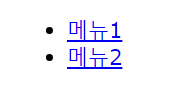
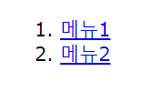
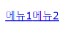
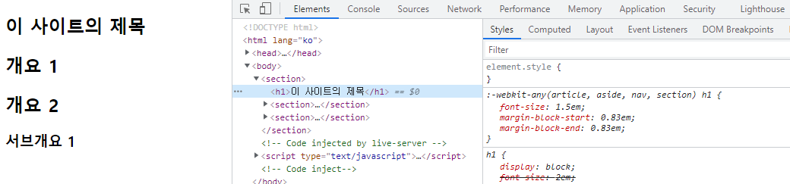
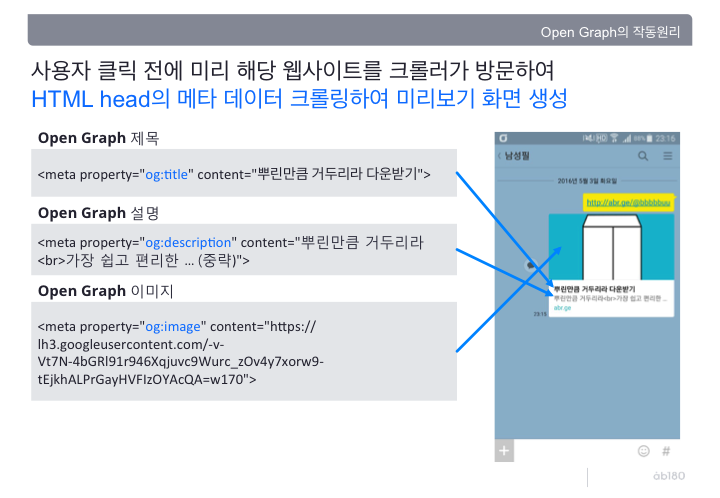

# 2021-09-11-Sat

<br/>

## 9월 2일 정기테스트 복습하기

#### 🍏 HTML 스타일 가이드에 적절하지 않은 것은?

🥄 Document type은 항상 선언한다. (적절)  
🥄 ~~element 내용은 대소문자를 사용.~~ (부적절)  
**-> 소문자만 일관적으로 사용한다.**  
🥄 닫지 않아도 되는 상황이어도, html elements를 항상 닫는다. (적절)  
🥄 `<html>`과 `<body>`는 생략하지 않는다. (적절)

<br/>
<br/>
<br/>
<br/>

#### 🍎 HTML 문서에서 가장 중요한 제목을 정의하는 태그는?

오답으로 `<title>`을 골랐지만, 답은 **`<h1>`.**  
핵심은 '가장 중요한' 제목에 있다.

<br/>
<br/>
<br/>
<br/>

#### 🍐 HTML 유효성 검사에서, Error와 Warning이 발생하는 이유는?

**🥄 `<section><p>Hello World</p></section>`**  
`section` 요소는 컨텐츠를 장, 절 등으로 구분할 때 사용한다고 한다.  
그래서 그 구분을 위해 헤딩 관련 요소를 사용하여 제목을 지정해야 한다고 한다.  
제목이 없는 경우는 장이나 절의 `section`이라고 보기 힘들어,  
반드시 제목을 제공하라고 한다.  
**그러므로 `<h1>`~`<h6>`을 `<section>` 요소 내에 포함해야 한다.**

<br/>

**🥄 ``**  
`` 태그에는 반드시 `alt` 속성을 부여해서,  
정상적으로 로드되지 않거나 웹 접근성을 위해야 한다.

<br/>

**🥄 `<html> ... </html>`**  
`<html>` 태그에는 `lang` 속성이 부여되어야 한다.  
이는 문서의 언어를 선언해주기 위함이다.

<br/>

**🥄 `<article><h3>Hello World</h3></article>`**  
Error가 발생하지 않는다.

<br/>
<br/>
<br/>
<br/>

#### 🍊 title 속성은?

**전역 특성**이며, 요소와 관련된 추가적인 정보를 나타내는 텍스트이다.  
해당 요소에 마우스 오버시, 툴팁처럼 나타낼 수 있다는 점!

<br/>

보통 `<abbr>` 태그와 같이 사용하여, 해당 약어를 설명해줄 수 있다.  
`<abbr title="이것은 고양이가 우는 소리입니다.">야옹야옹</abbr>`처럼 쓰면 된다!  
덕분에 기억 안나던 `<abbr>` 태그의 역할도 다시 인지.

<br/>
<br/>
<br/>
<br/>

#### 🍌 height 및 width가 가지고 있는 속성은?

`<length>`, `<percentage>`, `auto` 등!  
`auto`는 브라우저가 요소의 너비/높이를 계산해서 결정한다.

<br/>
<br/>
<br/>
<br/>

#### 🍉 테이블 태그에 대한 설명

**🥄 th (table header)는** 테이블의 제목을 정의하는 셀을 표현한다.  
 -> 위치를 규정하지는 않는다!

<br/>

**🥄 tr (table row)안의 td(table data)는** 각 행마다 크기를 조정할 수 있다.

<br/>

**🥄 colspan 속성**을 통해 여러 col을 합쳐 표현할 수 있다.  
-> `<td colspan="2">야옹</td>`와 같이 가능!

<br/>

**🥄 td의 기본 속성**은 왼쪽 정렬이다.

<br/>

> http://tcpschool.com/html-tags/th

<br/>
<br/>
<br/>
<br/>

#### 🍇 text formatting에 대하여

**🥄 `<del>`** 은 삭제된 텍스트 표시!

<br/>

**🥄 `<i>`** 는 이탤릭체로 표현

<br/>

**🥄 `<strong>`과 `<b>`** 는 텍스트를 진하게 표시하는 점에서는 동일하나,  
-> `<b>`은 단순 표시 역할이고, `<strong>`은 중요한 부분인 것을 브라우저에게 알려준다.  
이 차이점을 이해하고 적절하게 써야 한다.

<br/>

- 위의 `<i>`도 마찬가지로 전문 용어, 다른 언어 등을 표현하기 위해 기울이지만,  
  같은 표현을 하는 `<em>` 태그는 강조의 의미를 지니므로 차이가 있다.

<br/>

**🥄 `<small>`** 은 글자 크기를 줄임.

<br/>
<br/>
<br/>
<br/>

#### 🍓 HTML5에 새롭게 등장한 태그

`<section>`, `<article>`, `<aside>`, `<hgroup>`, `<header>`, `<footer>`,  
`<nav>`, `<figure>`, `<figcaption>` 과 같이 **구조적 표현을 위해 추가된 태그**들이 있다.

<br/>

또한 `<video>`, `<audio>`, `<source>`, `<track>`, `<embed>`,  
`<canvas>`, `<mark>`, `<progress>`, `<meter>`, `<time>`,  
`<ruby>`, `<bdi>`, `<wbr>`, `<command>`, `<details>`, `<datalist>`,  
`<keygen>`, `<output>`, `<input>`의 새로운 type 등이 있다.

<br/>

처음부터 HTML5를 사용해서 그런지,  
어떤 태그가 없어지고 새로 생겨났는지 관심이 없었다.  
지금 대부분 사용하는 태그들이 새로 생겨난 태그라는 것을 알았다!

<br/>
<br/>
<br/>
<br/>

#### 🍈 순서가 없는 내비게이션을 만들 때 적합한 HTML 태그 구조

🥄 `<ul><li><a href="#">메뉴1</a></li><li><a href="#">메뉴2</a></li></ul>`


<br/>

🥄 `<nav><li><a href="#">메뉴1</a></li><li><a href="#">메뉴2</a></li></nav>`


<br/>

🥄 `<ol><li><a href="#">메뉴1</a></li><li><a href="#">메뉴2</a></li></ol>`


<br/>

🥄 `<ul><a href="#">메뉴1</a><a href="#">메뉴2</a></ul>`


<br/>

첫번째와 두번째 태그가 순서 없는 내비게이션을 만들 수 있지만,  
순서 없는 메뉴를 만드는 목적에 적합한 **`ul`태그가 있는 첫번째 태그**가  
적절하다고 볼 수 있겠다.

<br/>
<br/>
<br/>
<br/>

#### 🍒 `` 태그의 `alt` 속성 역할

**🥄 이미지 경로를 받지 못하는 상황에서 이미지 대신 글자를 보여줄 수 있다.**  
**🥄 검색 엔진에 그림에 대한 정보를 전달한다.**  
**🥄 스크린 리더에 이미지 정보를 전달할 때 사용한다.**  
**🥄 ~~마우스 커서를 올릴 때 이미지 정보를 사용자에게 전달한다.~~**  
-> 이것은 `title` 속성으로 지정한다.

<br/>
<br/>
<br/>
<br/>

#### 🍑 meter 태그의 최솟값과 최댓값을 나타내는 속성

`meter` 요소란 특정 범위 내의 값이나 % 값을 나타내는데,  
`<meter min="0" max="100" low="30" high="60" optimum="90" value="50">`  
와 같이 지정하면, `low 이하`이면 적색, `low~high 범위`이면 황색,  
`high~optimum`이거나 `optimum 이상`이면 녹색으로 바가 나타났다.

<br/>
<br/>
<br/>
<br/>

#### 🥭 아래 태그의 오류를 찾자.

```html
<body>
  <main>
    <h1>이 사이트의 제목</h1>
    <section>
      <h2>개요 1</h2>
    </section>
    <section>
      <h2>개요 2</h2>
      <article>
        <h3>서브개요 1</h3>
      </article>
    </section>
  </main>
</body>
```

<br/>

🚑🚑🚑 당당하게 틀렸던 문제이다. 뭐가 문제일까?  
유효성 검사도 통과한다.  
_SEO(검색 엔진 최적화)를 지키기 위한 Heading-level outline이  
Structural outline과 같지 않다고 한다._

<br/>

이는 `<h1>`~`<h6>` 태그의 텍스트 크기가  
지정한 대로 적용되지 않았다는 의미라고 해석된다.  
실제로 브라우저에서 실험해 보았다.

<br/>

---

<br/>



<br/>
<br/>
<br/>

얼핏 보기에도 `<h1>` 태그와 `<h2>` 태그의 폰트 크기가 같다.  
심지어 `<h1>` 태그의 `2em` 크기 지정이 취소되고,  
`:-webkit-any(atricle, aside, nav, section) h1`의 `1.5em`이 적용되어 있다.  
`<h2>` 태그도 같은 `1.5em` 크기가 지정되어 있었다.

<br/>

---

<br/>

##### 🦴 아무래도 나는 다음과 같은 추론을 하였다.

<br/>

```html
<!DOCTYPE html>
<html lang="ko">
  <head>
    <meta charset="UTF-8" />
    <title>실습</title>
  </head>
  <body>
    <section>
      <h1>이 사이트의 제목</h1>
      <h2>개요 1</h2>
      <h2>개요 2</h2>
      <article><h3>서브개요 1</h3></article>
    </section>
  </body>
</html>
```

위와 같은 코드에서, 다른 레벨의 `h1`~`h6` 요소를 사용하여  
내부에 또 다른 `section` 요소의 중첩으로 암묵적 인지를 하였다고 생각한다.  
정답일지 오답일지는 모르겠지만 문제의 코드와 화면 출력 결과가 같았다.

<br/>

---

<br/>

##### 🦴 그리하여 코드가 이렇게 받아들여질 것이라고 추론하였다.

```html
<section>
  <h1>이 사이트의 제목</h1>
  <section>
    <h1>개요 1</h1>
  </section>
  <section>
    <h1>개요 2</h1>
    <article><h3>서브개요 1</h3></article>
  </section>
</section>
```

<br/>

또한 `<h1>` 태그의 폰트 크기는 `24px`로,  
`1.5em`이 `<h1>` 태그의 폰트 크기였던 것도 확인하였다.

<br/>

**결론적으로 이와 같은 문제를 예방하기 위하여,**  
**한 `section`에는 하나의 heading 태그를 쓰는 것이 좋을 것 같다.**

<br/>
<br/>
<br/>
<br/>

#### 🍍 텍스트를 대문자로 표현하면서 소문자형으로 나타내는 속성은?

`font-varient: small-caps`이다.  
대문자로 표현하지만 크기가 normal보다 조금 더 작다.  
상속이 가능한 속성이기도 하다.

<br/>
<br/>
<br/>
<br/>

#### 🥝 form의 속성

`<form action="/zerobase.html">`로 **`action` 속성**을 지정해주면,  
`zerobase.html` 파일로 해당 폼의 정보가 전달된다.  
`<form method="">`로 **`method` 속성**을 지정할 수 있는데,  
`get`, `post` 방식 등이 있다.

<br/>
<br/>
<br/>
<br/>

#### 🍅 meta 태그의 og:title, og:description 속성

복습하면서 제일 재밌었던 부분이다.  
`og`라 함은 `Open Graph` 프로토콜을 뜻한다. (페이스북에서 만들었다니..?)  
오픈 그래프는 HTML 문서의 meta 정보를 표시할 때 통일성을 위해 만든 것이라고 한다.

<br/>

누군가가 링크를 보내면, 썸네일과 설명이 있는 것을 볼 수 있는데,  
**애플리케이션이나 사이트가 링크를 인지하면 HTML head의 오픈 그래프의  
메타 데이터를 읽어와서 표시하는 원리**라고 한다.

<br/>

이 중 `og:title`, `og:description`, `og:image`는  
각각 타이틀과 설명, 이미지를 브라우저에게 알려준다.

<br/>

`<meta property="og:tltle" content="안녕, 제로베이스!">`와 같이 쓰면 된다.  
그리하면 아래와 같이 미리보기 화면이 생성된다.

<br/>
<br/>



> 출처 : https://blog.ab180.co/posts/open-graph-as-a-website-preview

<br/>
<br/>
