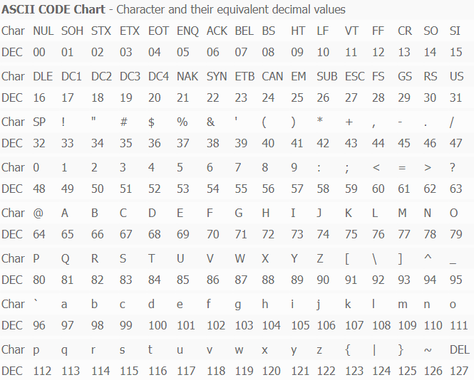

## 2021-09-24-Fri

<br/>

## 미션-2, 접근성 높은 데이터 테이블 제작하기

### 🌴 1. 접근성이 좋지 않은 테이블이 있는 웹페이지 선정

데이터 테이블이 있으면서 접근성이 좋지 않은 웹페이지를 찾아다녔다.  
떠오르는 웹사이트가 없어 정말 인터넷 세상을 탐험했는데,  
아무래도 많은 사용자를 거느리고 있는 사이트들은  
웹 접근성을 고려한 데이터 테이블을 가진 경우가 많았다.

<br/>

생각나는 대로 웹사이트를 이것저것 뒤져보던 중,  
문자를 아스키코드, 2진수, 16진수로 변환해주는 사이트를 발견했다.  
문제는 그 아래에 있는 아스키 코드 차트였는데,  
가독성도 매우 떨어질 뿐더러 웹 접근성을 고려하지 않았음을 발견했다.  
선정하게 된 사이트는 **https://www.easycalculation.com/ascii-hex.php** 이다.

<br/>
<br/>
<br/>
<br/>

### 🌳 2. 웹표준 준수 및 웹접근성 관점에서 기존 서비스의 문제점 분석

1번에서 언급했던 사이트의 아스키 코드 차트의 화면은 아래와 같다.

<br/>



<br/>
<br/>
<br/>

물론 이 사이트의 본질적인 서비스는  
문자를 입력하면 변환된 아스키 코드를 보여주는 데에 있지만,  
아스키 코드 차트도 첨부된 자료이므로  
웹 접근성을 고려해야 했음이 맞는 방향일 것이다.

<br/>

사실, 눈으로 봤을 때 가독성이 매우 떨어진다는 것을 제외하면  
웹 접근성을 고려했는지 정확하게 판단할 수 없어 해당 페이지의 코드를 참고했다.  
아래는 아스키 코드 차트 테이블의 일부이다.

<br/>

```html
<table>
  <tr>
    <td colspan="17">
      <b>ASCII CODE Chart</b>
    </td>
  </tr>
  <tr>
    <td>Char</td>
    <td>NUL</td>
    <td>SOH</td>
    <td>STX</td>
    <td>ETX</td>
    <td>EOT</td>
    <td>ENQ</td>
    <td>ACK</td>
    <td>BEL</td>
    <td>BS</td>
    <td>HT</td>
    <td>LF</td>
    <td>VT</td>
    <td>FF</td>
    <td>CR</td>
    <td>SO</td>
    <td>SI</td>
  </tr>
  <tr>
    <td>DEC</td>
    <td>00</td>
    <td>01</td>
    <td>02</td>
    <td>03</td>
    <td>04</td>
    <td>05</td>
    <td>06</td>
    <td>07</td>
    <td>08</td>
    <td>09</td>
    <td>10</td>
    <td>11</td>
    <td>12</td>
    <td>13</td>
    <td>14</td>
    <td>15</td>
  </tr>
</table>
```

<br/>

스크린리더가 읽을 수 있는 `scope`부터 해서,  
`caption`, `colgroup` 등이 아무 것도 쓰이지 않았다.  
`Char` 행과 `DEC` 행이 같은 색상으로 번갈아 연속적으로 나오면서  
행과 열을 동시에 찾아가야 하므로 불편했다.

<br/>

또한 아래와 같이 레이아웃을 위한 테이블 요소를 사용하였고,  
빈 셀에 대해 웹 접근성을 고려하지 않았다.

```html
<tr align="center">
  <td></td>
  <td></td>
  <td></td>
  <td></td>
  <td></td>
  <td></td>
  <td></td>
  <td></td>
  <td></td>
  ...
  <td></td>
</tr>
```

<br/>
<br/>
<br/>
<br/>

### 🌲 3. 해당 이슈를 WCAG 가이드라인에 맞춰 수정 계획 선정

바꾸고자 하는 레이아웃을 WCAG 가이드라인에 맞춰 수정하려 한다.  
우선, 데이터 테이블에서 오디오나 비디오, 텍스트가 아닌 요소(이미지 등)가 없어  
대부분 권고된 WCAG 가이드라인에서 제외되는 경우가 많았다.  
광과민성증후군을 가지고 있는 사용자를 위해 `다크모드/라이트 모드`도 구현하려고 한다.

<br/>
<br/>

🌻 **Guideline 1.3 Adaptable**
**Success Criterion 1.3.4 Orientation**
Content does not restrict its view and operation to a single display orientation, such as portrait or landscape, unless a specific display orientation is essential.

<br/>

특정 디스플레이 방향이 필수적이지 않다면,  
한 방향으로(가로 또는 세로)만 고정되어 작동하지 않도록 한다.  
**미디어쿼리를 사용하여 일반 스크린과 모바일 기기의 가로/세로 모드 적용을 고려할 것이다.**

<br/>
<br/>
<br/>
<br/>

🌻 **Guideline 1.3 Adaptable**
**Success Criterion 1.3.2 Meaningful Sequence**  
When the sequence in which content is presented affects its meaning, a correct reading sequence can be programmatically determined.

<br/>

컨텐츠가 표시되는 순서가 그것의 의미에 영향을 준다면,  
올바른 읽기 순서는 프로그래밍적으로 결정되어야한다.  
테이블을 읽어나가는 순서에 맞게 작성해야 한다.

<br/>
<br/>
<br/>
<br/>

🌻 **Guideline 1.4 Distinguishable**  
**Success Criterion 1.4.4 Resize text**  
Except for captions and images of text, text can be resized without assistive technology up to 200 percent without loss of content or functionality.

<br/>

텍스트의 크기가 보조기기, 컨텐츠 손상 없이 최대 200%까지 조정이 가능해야 한다.  
**이 부분과 관련된 수정 계획은 '큰 글자 모드 버튼' 만들기이다.**

<br/>
<br/>
<br/>
<br/>

🌻 **Guideline 2.1 Keyboard Accessible**  
Make all functionality available from a keyboard.

<br/>

모든 기능을 키보드로 가능하게끔 해야한다.  
아스키 코드 차트에서 수직 스크롤이 필요하다면,  
아래 방향키를 누르면 스크롤링이 되긴 하지만  
이동하는 스크롤 길이가 길지 않아 이것을 더 편리하게 구현해볼 예정이다.  
예를 들어 아래 방향키를 누르면 스크롤 이동 길이를 지정해주는 것이다.

<br/>
<br/>
<br/>
<br/>

**🌻 Guideline 2.4 Navigable**  
**Success Criterion 2.4.2 Page Titled**  
Web pages have titles that describe topic or purpose.

<br/>

웹 페이지는 주제와 목적을 설명할 수 있는 제목이 있어야 한다.

<br/>
<br/>
<br/>
<br/>

**🌻 Guideline 3.1 Readable**  
**Success Criterion 3.1.4 Abbreviations**  
A mechanism for identifying the expanded form or meaning of abbreviations is available.

<br/>

약어의 원래 의미를 인식할 수 있는 메커니즘이 있어야 한다.  
처음 아스키 코드 차트를 봤을 때, 00번인 NUL은 NULL로 읽을 수 있었지만,  
그 뒤의 VT, SO 등은 이해하기 어려우므로  
이와 같은 약어로 표현된 문자들은  
데이터 테이블에 `Description` 열을 추가해서 원래의 뜻을 알려줄 수 있도록 할 것이다.

<br/>
<br/>
<br/>
<br/>

### 🎄 4. 웹접근성 관련 체크리스트 작성

**1. caption 사용하기**  
 표의 제목, 설명 등이 들어가지만 화면에는 나타나지 않게 한다.  
 이것 조차 웹 접근성을 고려한 방법으로 해야 한다.  
 즉 `display: none` 등을 사용하지 않아야 한다.  
 테이블의 첫번째 자식으로 사용한다.

<br/>

**2. scope 속성 사용하기**  
 `<th>` 태그의 방향성을 알려준다.  
 즉 `<th scope="col">`이면 세로 방향의 항목을 가리킨다.  
 더해서, `colgroup` 등으로 셀 병합을 알려주어야 한다.  
 HTML5에서 `<td>` 태그의 scope 속성은 표준이 아니다.

<br/>

**3. `<thead>`, `<tbody>`, `<tfoot>` 사용하기**  
 `tbody`를 베이스로 `<thead>`, `<tfoot>`은 선택적이나,  
 모두 사용하는 경우 `<tbody>`보다 `<tfoot>`을 먼저 선언한다.  
 스크린 리더로 읽을 시 `<tbody>`의 크기가 크면  
 `<tfoot>`에 도달하는 데까지 시간이 오래 걸리기 때문이다.

<br/>
<br/>
<br/>
<br/>

### 🌿 5. HTML/CSS를 활용하여 구현

<br/>
<br/>
<br/>
<br/>

### 🍀 6. 문법 검사 결과

<br/>
<br/>
<br/>
<br/>

### 🍃 7. 라이트하우스에서의 접근성 및 SEO 관련 분석 리포트

<br/>
<br/>
<br/>
<br/>

### 🌵 8. 프로젝트 완료 후기

<br/>
<br/>
<br/>
<br/>
