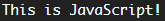

# 2021-09-25-Sat

<br/>

## 1. 개요

### 🖤 자바스크립트란 무엇인가?

프로그래밍 언어 랭킹 7위를 달리고 있는 자바스크립트!  
**자바스크립트란** 웹페이지를 동적으로 만들기 위한  
객체 기반의 스크립트 언어이다.  
스크립트 언어이므로 컴파일 과정이 필요 없다.  
HTML 안에 작성하면 웹페이지를 불러올 때 자동으로 실행된다.  
또한 자바스크립트 엔진이 있는 디바이스면 모두 작동시킬 수 있다.  
그 종류에는 V8, SpiderMonkey가 있다.

<br/>
<br/>
<br/>
<br/>

### 💜 어떻게 동작하는가?

먼저 엔진이 스크립트를 읽는다. 이를 `파싱`이라고 한다.  
다음, 읽어들인 스크립트를 컴퓨터가 알 수 있는 기계어로 전환한다.  
이후 기계어로 전환된 코드가 실행된다.

<br/>
<br/>
<br/>
<br/>

### 💙 기본 입출력

입출력은 말 그대로 입력과 출력을 더한 개념이며,  
사용자가 프로그램과 상호작용하기 위한 방법이다.  
C언어에서 `<stdio.h>`의 `stdio`도  
standard input/output의 의미를 가지는 표준 입출력을 뜻한다.  
표준 입력(stdin)은 컴퓨터의 키보드로부터 받아오는 것이다.  
표준 출력(stdout)은 모니터에 출력되는 것을 말하며,  
프로그램을 실행한 결과 등을 출력해준다.

<br/>

직접 텍스트 파일을 작성하고, 콘솔에 결과를 출력해본다.

<br/>

```js
const fs = require("fs");
const input = fs.readFileSync(__dirname + "/2021-09-25-IO.txt", "utf-8");

console.log(input);
```

<br/>

이 부분에서 `Error: ENOENT: no such file or directory, open '2021-09-25-IO.txt'` 에러가 발생했다.  
이는 파일의 경로와 현재 작업 중인 경로의 상대적 위치가 맞지 않아 발생하는 것이다.  
그러므로 `__dirname`이라는 내장 변수를 사용하여  
경로를 절대적으로 지정해주었다.  
출력 결과는 해당 텍스트 파일과 동일하게 나왔다!

<br/>



<br/>
<br/>
<br/>
<br/>

### 💚 표현식이 프로그램이 되는 과정과 기본 용어

`다수의 표현식으로 하나의 명령문을 만들고, 명령문들을 프로그램이 수행한다.`  
`let`, `사과`, `"맛있다"` 세 개의 표현식들을 모아  
`let 사과 = "맛있다";`로 명령문을 만들 수 있고,  
이것들이 모여 프로그램이 될 수 있다.  
명령문 하나들의 끝마침은 `;`으로 알려준다.

<br/>

위의 명령문 `let 사과 = "맛있다";`는  
어떤 메모리 공간에 `사과`라는 이름을 붙여주고,  
그 안에 `"맛있다"`라는 값을 넣는다는 의미이다!

<br/>

#### 그래서..어디에 저장되는데?

C언어처럼 메모리 주소를 확인해보려고 했으나..  
확인이 불가했다?!  
어딘가에 저장은 되는데 콘솔로 확인하지 못하는 듯 하다.  
GC가 괜히 있는게 아니라나.  
굉장히 찝찝하다.

<br/>

`키워드`는 자바스크립트에서 주어진 일을 하기 위해 미리 정의한 단어이다.  
그래서 변수명으로 쓸 수 없다.

<br/>

`식별자`는 개발자가 변수나 함수에 붙이는 이름인데,  
대소문자를 구별하며 `숫자 시작`, `_와 $ 이외의 특수문자`, `공백 문자`의 사용이 불가하다.

<br/>

`주석`은 말 그대로 comment인데, 컴파일러는 이를 실행시키지 않는다.  
`// comment`, `/* comment */` 처럼 쓸 수 있다.  
하지만 많이 쓰면 파일의 용량도 같이 올라간다는 점!

<br/>
<br/>
<br/>
