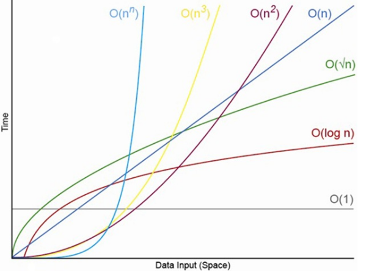

# 2021-09-30-Thu

<br/>

## 6. 수학 기본

### 👷 개요

코딩만 공부한다고 코딩 테스트를 다 풀 수 있는 것은 아니었다.  
즉 코딩테스트에 쓰이는 수학적 개념이 몇몇 있다.  
`경우의 수`, `점화식` 등이 그 예이다.  
이제부터 그 개념들을 차근차근 공부해본다.

<br/>
<br/>
<br/>
<br/>

### 👷 알고리즘 복잡도

알고리즘 성능을 평가하는 지표에는  
정확성, 작업량, 메모리 사용량, 최적성, 효율성(시간 복잡도, 공간 복잡도)이 있다.

<br/>
<br/>

알고리즘 복잡도 중의 시간 복잡도는  
알고리즘의 수행 시간을 평가하는 방법이다.  
빅오 표기법이라고 하여 `O(n)`으로 표기하는 방법,  
`세타`, `오메가` 등이 있다.  
연산에 따라 나오는 시간 복잡도에 있어서,  
입력되는 데이터의 개수에 따라 시간 복잡도가 굉장히 상승하는 경우가 있다.  
그림으로 보면 아래와 같다.

<br/>



<br/>
<br/>

`O(1)`은 입력 데이터와 관계 없이 시간이 일정한 반면,  
`O(n^n)`의 경우 어느 지점부터 기하급수적으로 상승하는 것을 볼 수 있다.  
그러므로 우리는 시간 복잡도가 낮은 알고리즘을 짜는 것이 좋다고 볼 수 있겠다.

<br/>

보통 반복문의 개수로 시간 복잡도를 대강 알 수 있을 때가 있다.  
for문이 1개인 간단한 프로그램을 예로 들면  
이 코드의 시간 복잡도는 `O(n)`이다.  
만약 이중 for문이라면 `O(n^2)`이 된다.

<br/>

**for문이 하나라고 해서 시간 복잡도가 항상 `O(n)`인 것은 아니고**,  
`i = 0`부터 n 이전까지의 반복을 했을 때가 그러하다.  
예시로 `for (let i = 0; i < n; i = i * 2)` 인 경우,  
n번의 연산이 아닌 n/2번의 연산을 하게 되는데  
이 때의 시간 복잡도는 `O(n)`이 아닌 `O(log N)`이 된다.

<br/>
<br/>
<br/>
<br/>

### 👷 경우의 수

`경우의 수`는 어떤 일이 일어날 수 있는 경우의 모든 가짓수를 표현하는 것이다.  
주사위의 경우 던지는 수는 1~6이므로 6가지이고,  
가위바위보는 가위, 바위 보의 3가지이다.

<br/>

하지만 _경우의 수도 조건에 따라 그 수가 달라질 수 있는데_,  
두 사람이 가위보를 했을 때 나올 수 있는 경우의 수는 총 9가지가 된다.  
이는 한 사람이 낼 수 있는 경우의 수인 3가지와  
나머지 한 사람이 낼 수 있는 경우의 수인 3가지를 곱하여 그렇게 된 것이다.

<br/>

이는 일상생활에서의 경우의 수이고,  
알고리즘에서는 `순열`, `조합`, `중복 순열` 등을 쓴다.  
**`순열`** 은 서로 다른 n개의 원소 중에서 r를 **중복 없이 골라 순서에 상관있게** 나열,  
**`조합`** 은 서로 다른 n개의 원소 중에서 r를 **중복 없이 골라 순서에 상관없이 나열**,  
**`중복 순열`** 은 위 두가지 개념을 합친  
서로 다른 n개의 원소 중에서 r개를 **중복을 포함하여 골라 순서에 상관없이 나열**하는 것이다.

<br/>

순열의 경우 1번, 2번, 3번의 사람을 줄 세우기 하는 것이 예시가 될 수 있다.  
조합의 경우 다양한 과일 중 n개를 뽑는 것이 있을 수 있다.  
이 때는 순서에 상관이 없다.  
뽑은 사실 그 자체를 중시하는 것이다.

<br/>

**`점화식`** 은 수열에서 이웃하는 두 항들 간에 성립하는 관계를 나타낸 관계식이다.  
**`등차 수열`** 은 각 항마다 어떤 수가 더해지는 것이고,  
**`등비 수열`** 은 각 항마다 어떤 수가 곱해지는 것이다.  
이 어떤 수는 상수이며, 고정된 값이다.  
특이하게 F(n) = F(n - 1) + F(n - 2)의 관계가 성립하는 수열을  
**`피보나치 수열`** 이라고 한다.

<br/>
<br/>
<br/>
<br/>

### 👷 순열

**`순열`** 은 서로 다른 n개의 원소 중  
r를 중복 없이 골라 순서에 상관 있게 나열하는 경우의 수라고 하였다.

<br/>

`a`, `b`, `c`라는 알파벳 3개로 단어를 만드는 경우의 수가 그 예시이다.  
`abc`, `acb`, `bac`, `bca`, `cab`, `cba`로 6가지 경우가 될 것이다.  
처음에 a를 뽑으면 그 다음에는 b, c 중 하나가 올 수 있고,  
a와 b를 뽑으면 남는 것은 c 하나 뿐이다.  
즉 첫번째 뽑는 알파벳의 경우의 수가 3개,  
두번째는 2개, 3번째는 1개로 이들을 모두 곱하여 총 6개가 된다.  
코드로 실습해본다.

<br/>

```js
let input = ["a", "b", "c"];
let count = 0;

function permutation(arr) {
  for (let i = 0; i < arr.length; i++) {
    for (let j = 0; j < arr.length; j++) {
      if (i == j) continue;
      for (let k = 0; k < arr.length; k++) {
        if (i == k) continue;
        if (j == k) continue;

        console.log(arr[i], arr[j], arr[k]);
        count++;
      }
    }
  }
}

permutation(input);
console.log(count);
```

<br/>

위 예제는 반복문을 3중으로 구성해 가장 기본적으로 풀 수 있는 알고리즘이다.  
맨 앞부터 `input` 배열의 인덱스의 값에 접근하여  
a를 뽑았다면 그다음은 a를 뽑지 않도록 하였고,  
a와 b를 뽑았다면 aba와 abb를 뽑지 않도록 구성된 것이다.  
그 다음으로는 재귀적으로 함수를 구성하는 방법이 있다.

<br/>

```js
let input = ["a", "b", "c"];
let count = 0;

function permutation(arr, s, r) {
  if (s == r) {
    count++;
    console.log(arr.join(" "));
    return;
  }

  for (let i = s; i < arr.length; i++) {
    [arr[s], arr[i]] = [arr[i], arr[s]];
    permutation(arr, s + 1, r);
    [arr[s], arr[i]] = [arr[i], arr[s]];
  }
}

permutation(input, 0, 2);
console.log(count);
```

<br/>
<br/>
<br/>
<br/>

### 👷 조합

**`조합`** 은 서로 다른 n개의 원소 중에서  
r를 중복 없이 골라 순서에 상관 없이 나열하는 경우의 수라고 하였다.  
사실상 순열에서 `순서`를 고려하는 부분만 제외해주면 된다.  
카드 뽑기라고 가정하면, 달과 해 카드를 뽑았으면 그 순서는 상관이 없는 것이다.  
그러므로 4개의 카드 중 2개를 뽑는다고 가정하면  
12 13 14 23 24 34의 경우로 6가지가 가능하다.  
순서를 고려한다면 12 13 14 21 23 24 31 32 34 41 42 43으로  
12가지가 나와야 한다.  
이 예제를 아래 코드에서 공부해본다.

<br/>

```js
let input = [1, 2, 3, 4];
let count = 0;

function combination(arr) {
  for (let i = 0; i < arr.length; i++) {
    for (let j = i + 1; j < arr.length; j++) {
      count++;
      console.log(arr[i], arr[j]);
    }
  }
}

combination(input);
console.log(count);
```

<br/>

처음에 1번 카드를 뽑았다면 그 다음에는 1번 카드가 선택에서 제외되어야 한다.  
그러므로 내부 for문에서 조건을 `let j = i + 1;`로 설정한 것이다.

<br/>
<br/>
<br/>
<br/>

### 👷 점화식

<br/>
<br/>
<br/>
<br/>

### 👷 기본 문제 풀이 - 등차수열의 항 찾기

<br/>
<br/>
<br/>
<br/>

### 👷 기본 문제 풀이 - 잃어버린 카드 찾기

<br/>
<br/>
<br/>
<br/>
