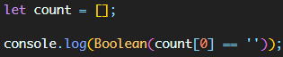

# 2021-10-01-Fri

<br/>

## 7. 수학 실전문제풀이 - 2

### 👻 7. 직사각형 별찍기 (반복문)

#### 문제 설명

이 문제에는 표준 입력으로 두 개의 정수 n과 m이 주어집니다.  
별(\*) 문자를 이용해 가로의 길이가 n, 세로의 길이가 m인 직사각형 형태를 출력해보세요.

<br/>

#### 제한 조건

n과 m은 각각 1000 이하인 자연수입니다.

<br/>

#### 예시

`입력`  
5 3

<br/>

`출력`  
`*****`  
`*****`  
`*****`

<br/>
<br/>

📕 **나의 풀이**

```js
process.stdin.setEncoding("utf8");
process.stdin.on("data", (data) => {
  const n = data.split(" ");
  const a = Number(n[0]),
    b = Number(n[1]);

  // 1. a는 한 라인 당 별의 개수이다.
  // 2. b는 라인의 개수이다.
  // 3. 그러므로 반복문의 a, b 순서가 역전돼야 한다.

  for (let i = 0; i < b; i++) {
    let result = "";
    for (let j = 0; j < a; j++) {
      result += "*";
    }
    console.log(result);
  }
});
```

<br/>
<br/>

📗 **다른 풀이**

```js
process.stdin.on("data", (data) => {
  const n = data.split(" ");
  const a = Number(n[0]),
    b = Number(n[1]);
  const r = "*".repeat(a);
  for (let i = 0; i < b; i++) console.log(r);
});
```

<br/>
<br/>

📘 **코멘트**  
반복문에서 가장 흔히 연습해볼 수 있는 별찍기 문제!  
별찍기를 참 못한다고 생각하는데,  
이는 반복문의 기본 원리에 대해 잘 알지 못했던 탓이 아닌가 싶다.

<br/>

이중으로 for문을 구성해도 되지만,  
`const r = "*".repeat(a)`로 a 갯수만큼 `"*"`를 반복할 수 있다는 것을 배웠다.  
왠지 써먹을 데가 많아 보이는 메서드이다.

<br/>
<br/>
<br/>

### 👻 8. 두 정수 사이의 합 (반복문, 조건문)

#### 문제 설명

두 정수 a, b가 주어졌을 때 a와 b 사이에 속한 모든 정수의 합을 리턴하는 함수, solution을 완성하세요.  
예를 들어 a = 3, b = 5인 경우, 3 + 4 + 5 = 12이므로 12를 리턴합니다.

<br/>

#### 제한 조건

- a와 b가 같은 경우는 둘 중 아무 수나 리턴하세요.
- a와 b는 -10,000,000 이상 10,000,000 이하인 정수입니다.
- a와 b의 대소관계는 정해져있지 않습니다.

<br/>

#### 입출력 예

`a b return`  
3 5 12  
3 3 3  
5 3 12

<br/>
<br/>

📕 **나의 풀이**

```js
function solution(a, b) {
  var answer = 0;

  // 1. a가 b보다 큰 경우 a부터 b까지 더한다.
  // 2. b가 a보다 큰 경우 a와 b의 순서를 바꾼다.

  if (a < b) {
    for (let i = a; i <= b; i++) {
      answer += i;
    }
  } else if (a > b) {
    for (let i = b; i <= a; i++) {
      answer += i;
    }
  } else {
    answer = a;
  }

  return answer;
}
```

<br/>
<br/>

📗 **다른 풀이 1**

```js
function solution(a, b) {
  let sum = 0;
  if (a > b) [a, b] = [b, a];

  for (let i = a; i <= b; i++) sum += i;

  return sum;
}
```

<br/>

📗 **다른 풀이 2**

```js
function solution(a, b) {
  return ((a + b) * (Math.abs(a - b) + 1)) / 2;
}
```

<br/>
<br/>

📘 **코멘트**  
a가 b보다 큰 경우와 작은 경우를 나누어서  
그에 따라 반복 변수를 역전시켜 주는 것으로 구성했다.

<br/>

**다른 풀이 1**에서 처음부터 a가 b보다 크면 swap만 해주는 것이 굉장히 깔끔했다.  
혼자 오래 고민하며 구구절절 적었던 코드보다 훨씬 컴팩트한 것을 볼 때마다  
신기하기도 하고..말로는 설명 못할 감정들이 자주 든다.

<br/>

**다른 풀이 2**는 수학적 개념을 적용한 것인데,  
1부터 n까지의 합은 `n * (n + 1) / 2`로 구할 수 있다는 가우스 공식이 있다.  
이를 코드로 쓴 것이 다른 풀이 2였다.  
또한 a와 b의 대소관계를 위해 간단히 `Math.abs(a - b)`를 이용했다.

<br/>
<br/>
<br/>

### 👻 9. 부족한 금액 계산하기 (반복문, 조건문)

#### 문제 설명

새로 생긴 놀이기구는 인기가 매우 많아 줄이 끊이질 않습니다. 이 놀이기구의 원래 이용료는 price원 인데, 놀이기구를 N 번 째 이용한다면 원래 이용료의 N배를 받기로 하였습니다. 즉, 처음 이용료가 100이었다면 2번째에는 200, 3번째에는 300으로 요금이 인상됩니다.  
놀이기구를 count번 타게 되면 현재 자신이 가지고 있는 금액에서 얼마가 모자라는지를 return 하도록 solution 함수를 완성하세요.  
**단, 금액이 부족하지 않으면 0을 return** 하세요.

<br/>

#### 제한사항

- 놀이기구의 이용료 price : 1 ≤ price ≤ 2,500, price는 자연수
- 처음 가지고 있던 금액 money : 1 ≤ money ≤ 1,000,000,000, money는 자연수
- 놀이기구의 이용 횟수 count : 1 ≤ count ≤ 2,500, count는 자연수

<br/>

#### 입출력 예

`price money count result`  
3 20 4 10

<br/>

#### 입출력 예 설명

##### 입출력 예 #1

이용금액이 3인 놀이기구를 4번 타고 싶은 고객이 현재 가진 금액이 20이라면, 총 필요한 놀이기구의 이용 금액은 30 (= 3+6+9+12) 이 되어 10만큼 부족하므로 10을 return 합니다.

<br/>
<br/>

📕 **나의 풀이**

```js
function solution(price, money, count) {
  var answer = -1;

  // 1. 필요한 금액은 초기금액 + 초기금액 x 2 + ... + 초기금액 x n이 된다.
  // 1.1. 초기금액은 price이고, n은 count이다.
  // 2. 금액이 모자라는 것은 money - 총 price가 0보다 작을 때이다.

  let sum = 0;

  for (let i = 1; i <= count; i++) {
    sum += price * i;
  }

  if (money - sum < 0) {
    answer = -(money - sum);
  } else {
    answer = 0;
  }

  return answer;
}
```

<br/>
<br/>

📗 **다른 풀이 1**

```js
function solution(price, money, count) {
  var answer = 0;

  for (let i = 1; i <= count; i++) {
    answer += i;
  }

  answer *= price;

  return money >= answer ? 0 : answer - money;
}
```

<br/>

📗 **다른 풀이 2**

```js
function solution(price, money, count) {
  let answer = price * ((count * (1 + count)) / 2) - money;
  return answer > 0 ? answer : 0;
}
```

<br/>
<br/>

📘 **코멘트**  
이용할 때마다 count배만큼의 금액이 든다.  
그러므로 총 금액은 등비수열의 모든 항의 합이 되며,  
가지고 있는 money에서 price를 뺀 것이 모자라느냐, 그렇지 않느냐가 관건이다.

<br/>

**다른 풀이1**에서는 3 x 1 + 3 x 2 + ... + 3 x n 을 하지 않고,  
먼저 (1 + 2 + ... + n)을 해준 뒤 기본 요금을 곱해주었다.  
이렇게 해주면 어차피 분배식으로 계산되므로 결과는 같게 되고,  
매번 기본 요금을 곱해주지 않아도 된다.

<br/>

그리고 **다른 풀이2**에서는 이 (1 + 2 + ... + n)을  
위에서 언급했던 가우스 공식으로 풀어내었다.

<br/>
<br/>
<br/>

### 👻 10. K번째 수 (반복문, Array)

#### 문제 설명

배열 array의 i번째 숫자부터 j번째 숫자까지 자르고 정렬했을 때, k번째에 있는 수를 구하려 합니다.  
**예를 들어 array가 [1, 5, 2, 6, 3, 7, 4], i = 2, j = 5, k = 3이라면**

**1.** array의 2번째부터 5번째까지 자르면 [5, 2, 6, 3]입니다.
**2.** 1에서 나온 배열을 정렬하면 [2, 3, 5, 6]입니다.
**3.** 2에서 나온 배열의 3번째 숫자는 5입니다.
배열 array, [i, j, k]를 원소로 가진 2차원 배열 commands가 매개변수로 주어질 때, commands의 모든 원소에 대해 앞서 설명한 연산을 적용했을 때 나온 결과를 배열에 담아 return 하도록 solution 함수를 작성해주세요.

<br/>

#### 제한사항

- array의 길이는 1 이상 100 이하입니다.
- array의 각 원소는 1 이상 100 이하입니다.
- commands의 길이는 1 이상 50 이하입니다.
- commands의 각 원소는 길이가 3입니다.

<br/>

#### 입출력 예

`array commands return`  
`[1, 5, 2, 6, 3, 7, 4]` `[[2, 5, 3], [4, 4, 1], [1, 7, 3]]` `[5, 6, 3]`

<br/>

#### 입출력 예 설명

[1, 5, 2, 6, 3, 7, 4]를 2번째부터 5번째까지 자른 후 정렬합니다. [2, 3, 5, 6]의 세 번째 숫자는 5입니다.  
[1, 5, 2, 6, 3, 7, 4]를 4번째부터 4번째까지 자른 후 정렬합니다. [6]의 첫 번째 숫자는 6입니다.  
[1, 5, 2, 6, 3, 7, 4]를 1번째부터 7번째까지 자릅니다. [1, 2, 3, 4, 5, 6, 7]의 세 번째 숫자는 3입니다.

<br/>
<br/>

📕 **나의 풀이**

```js
function solution(array, commands) {
  var answer = [];

  // 1. commands의 행마다 접근한다.
  // 2. 배열을 행의 0번째, 1번째 인덱스로 자르고 정렬한다.
  // 3. 배열의 2번째 인덱스에 해당하는 값을 찾는다.
  // 4. 이 값을 answer에 push한다.

  let temp_array = [];
  for (let i = 0; i < commands.length; i++) {
    temp_array = array.slice(commands[i][0] - 1, commands[i][1]);
    temp_array.sort((x, y) => x - y);
    answer.push(temp_array[commands[i][2] - 1]);
  }
  return answer;
}
```

<br/>
<br/>

📗 **다른 풀이**

```js
function solution(array, commands) {
  return commands.map((command) => {
    const [s, e, p] = command;
    return array.slice(s - 1, e).sort((x, y) => x - y)[p - 1];
  });
}
```

<br/>
<br/>

📘 **코멘트**  
commands의 한 행마다 초기에 접근해서,  
그 한 행마다의 열에 접근하여 `commands[i][0]`부터 `commands[i][1]`까지 자르도록 하였다.  
하지만 주어진 조건에서 만약 2번째부터~라고 한다면 이는 1번째 인덱스에 속하므로  
`commands[i][0] - 1`과 같이 써야 했다.

<br/>

**다른 풀이**에서는 이 commands의 외부 덩어리에 접근하는 것을  
`map` 메서드를 이용해서 각각 한 행의 값들을 `[s, e, p]`로 넣어주었다.  
그리고 array를 s - 1부터 e까지 잘라 정렬하고, 바로 p - 1 인덱스로 접근해 값을 찾았다.

<br/>
<br/>
<br/>

### 👻 11. 나누어 떨어지는 숫자 배열 (반복문, 조건문, Array)

#### 문제 설명

array의 각 element 중 divisor로 나누어 떨어지는 값을 오름차순으로 정렬한 배열을 반환하는 함수, solution을 작성해주세요.  
**divisor로 나누어 떨어지는 element가 하나도 없다면 배열에 -1을 담아 반환**하세요.

<br/>

#### 제한사항

- arr은 자연수를 담은 배열입니다.
- 정수 i, j에 대해 i ≠ j 이면 arr[i] ≠ arr[j] 입니다.
- divisor는 자연수입니다.
- array는 길이 1 이상인 배열입니다.

<br/>

#### 입출력 예

`arr divisor return`  
`[5, 9, 7, 10]` `5` `[5, 10]`  
`[2, 36, 1, 3]` `1` `[1, 2, 3, 36]`  
`[3,2,6]` `10` `[-1]`

<br/>

#### 입출력 예 설명

##### 입출력 예#1

arr의 원소 중 5로 나누어 떨어지는 원소는 5와 10입니다. 따라서 [5, 10]을 리턴합니다.

##### 입출력 예#2

arr의 모든 원소는 1으로 나누어 떨어집니다. 원소를 오름차순으로 정렬해 [1, 2, 3, 36]을 리턴합니다.

##### 입출력 예#3

3, 2, 6은 10으로 나누어 떨어지지 않습니다. 나누어 떨어지는 원소가 없으므로 `[-1]`을 리턴합니다.

<br/>
<br/>

📕 **나의 풀이**

```js
function solution(arr, divisor) {
  var answer = [];

  // 1. divisor로 나누어 떨어지는 값을 필터링한다.
  // 2. 필터링한 배열을 정렬한다.
  // 3. 조건에 맞는 요소가 없는 경우 빈 배열이 반환되므로 빈 배열일 경우 -1을 push한다.

  answer = arr.filter((item) => item % divisor == 0);
  answer.sort((x, y) => x - y);

  if (answer == "") {
    answer.push(-1);
  }

  return answer;
}
```

<br/>
<br/>

📗 **다른 풀이 1**

```js
function solution(arr, divisor) {
  let answer = [];

  for (let i = 0; i < arr.length; i++) {
    if (arr[i] % divisor == 0) {
      answer.push(arr[i]);
    }
  }
  return answer.length ? answer.sort((x, y) => x - y) : [-1];
}
```

<br/>

📗 **다른 풀이 2**

```js
function solution(arr, divisor) {
  let answer = arr.filter((n) => n % divisor == 0);
  return answer.length ? answer.sort((x, y) => x - y) : [-1];
}
```

<br/>
<br/>

📘 **코멘트**  
나누어 떨어지는 배열 요소만 다른 배열에 추가한다.  
만약 배열에 추가된 값이 없으면, -1을 반환한다.  
`배열에 추가된 값이 없으면(빈 배열이면)`을 어떻게 작성해낼지 고민했는데,  
일단 나의 경우 `arr = ""`로 검사했다.  
나머지 풀이 두 개에서 배울 점을 찾아보았다.

<br/>

**다른 풀이 1**과 **다른 풀이 2**에서는  
**`answer.length`가 0인지를 검사**했고,  
길이가 있으면 정렬하고 없으면 -1을 반환하도록 했다.  
내가 쓴 `arr = ""`보다는 훨씬 이해하기 쉬운 코드인 것 같다.  
빈 배열일 때 굳이 -1을 push 해주지 않아도 되고 말이다.

<br/>
<br/>
<br/>

### 👻 12. 같은 숫자는 싫어 (반복문, 조건문, Array)

#### 문제 설명

배열 arr가 주어집니다. 배열 arr의 각 원소는 숫자 0부터 9까지로 이루어져 있습니다. 이때, 배열 arr에서 연속적으로 나타나는 숫자는 하나만 남기고 전부 제거하려고 합니다. 단, 제거된 후 남은 수들을 반환할 때는 배열 arr의 원소들의 순서를 유지해야 합니다. **예를 들면,**

**1.** arr = [1, 1, 3, 3, 0, 1, 1] 이면 [1, 3, 0, 1] 을 return 합니다.
**2.** arr = [4, 4, 4, 3, 3] 이면 [4, 3] 을 return 합니다.
배열 arr에서 연속적으로 나타나는 숫자는 제거하고 남은 수들을 return 하는 solution 함수를 완성해 주세요.

<br/>

#### 제한사항

- 배열 arr의 크기 : 1,000,000 이하의 자연수
- 배열 arr의 원소의 크기 : 0보다 크거나 같고 9보다 작거나 같은 정수

<br/>

#### 입출력 예

`arr answer`  
`[1,1,3,3,0,1,1]` `[1,3,0,1]`  
`[4,4,4,3,3]` `[4,3]`

<br/>
<br/>

📕 **나의 풀이**

```js
function solution(arr) {
  var answer = [];

  // 1. 앞의 요소와 뒤의 요소가 같은지 확인하고 다르면 넣는다.
  // 2. 같은 경우 처음 나온 숫자인 경우만 넣는다.

  let count = [];

  for (let i = 0; i < arr.length; i++) {
    if (arr[i] == arr[i + 1]) {
      if (count[i] == "") {
        answer.push(arr[i]);
        count[i]++;
      } else {
        continue;
      }
    } else {
      answer.push(arr[i]);
      count[i]++;
    }
  }

  return answer;
}
```

<br/>
<br/>

📗 **다른 풀이 1**

```js
function solution(arr) {
  let answer = [];

  for (let i = 0; i < arr.length - 1; i++) {
    if (arr[i] != arr[i + 1]) {
      answer.push(arr[i]);
    }
  }
  answer.push(arr[arr.length - 1]);
  return answer;
}
```

<br/>

📗 **다른 풀이 2**

```js
function solution(arr) {
  return arr.filter((v, i) => v != arr[i + 1]);
}
```

<br/>
<br/>

📘 **코멘트**  
배열을 요소마다 앞뒤로 비교해서 같은 숫자가 나오면  
해당 숫자에 대한 count 배열의 값을 증가시켰다.  
즉 처음 나온 숫자에 대해서만 push를 허용하고,  
아닌 경우 `continue;`를 했다.  
그리고 앞 뒤 숫자가 다른 경우 앞의 숫자를 넣어주도록 했다.  
정리하자면, 앞 뒤 숫자가 같은 경우 앞의 숫자만 넣어주고,  
앞 뒤 숫자가 다른 경우 앞 숫자를 넣기로 했다.

<br/>

**하지만 til을 작성하면서 보니 이 방식은 완전히 틀렸음을 깨달았다.**  
하루가 지나서 보니 이상한 점이 한 두가지가 아닌 것이다!  
코드를 작성할 당시는 몰랐다.

<br/>

일단 파악한 문제점은, `1 1 2`와 같은 예시에서이다.  
처음 `1 1`일 경우, `count[0]`은 비었으므로 1이 push된다.  
그 다음 `1 2`일 경우, `count[1]`은 비었으므로 1이 push된다.  
그러니까 `1 2`가 answer여야 하는데, `1 1`이 answer였을 것이다.  
하지만 정상적으로 `1 2`가 출력되었는데, 원인을 파악해보았다.

<br/>



<br/>
<br/>

예상했던 대로, count의 값을 `''`로 검사하는 부분에서 잘못된 것이다.  
애초에 배열은 키와 값으로 구성된 것이 아니므로,  
`1이 3번, 3이 2번`과 같은 데이터를 저장할 수 없다.

<br/>

그리고 i가 증가하는 반복문 안에 같이 넣어주었기 때문에,  
만약 빈 값으로 초기화된 배열을 잘 선언했다고 해도,  
접근하는 count 값은 항상 비어있다.  
1이 두 번 나왔다고 count가 증가되지 않는 것이다.

<br/>

결론적으로 `if (count[i] == '')` 부분이 무시되어  
`answer.push(arr[i])`의 중복 삽입이 실행되지 않았고,  
그래서 테스트케이스를 모두 통과하긴 했지만  
완전히 잘못된 코드인 것이다.

<br/>

`count`를 쓸 필요도 없는게, 만약 1이 2번 나온 것을 어떻게든 체크했다고 쳐도,  
**연속된 같은 숫자만 배제**하는 개념이므로 적합하지 않다고 생각이 들었다.  
중복만 제외하는 것이라면 오히려 `Set`을 쓰는 게 나을 정도이기도 하고.

<br/>

**다른 풀이 1**에서는 요소를 순회하며 값이 같지 않은 경우만 앞 요소를 push했고,  
앞 요소만 push하므로 제외될 수 있는 마지막 요소를 고려하여  
`arr[arr.length - 1]`을 해주었다.

<br/>

**다른 풀이 2**에서는 `filter()` 메서드를 사용해서,  
현재 value와 그 다음 인덱스의 값이 같지 않을 경우만 모아  
새 배열로 반환하였다.

<br/>

더 직관적으로 접근할 수 있는 방법이 분명 있었음에도 불구하고  
전혀 문제 의도와 적합하지 않은 코드를 작성한 것이 아쉽다.  
그리고 나의 코드를 2번, 3번씩 눈으로 따라가며 읽어보지 않았다면  
몰랐을 것을 생각하니 소름도 돋는다.  
너무 어렵게만 생각하지 말자..! 🖐

<br/>
<br/>
<br/>
