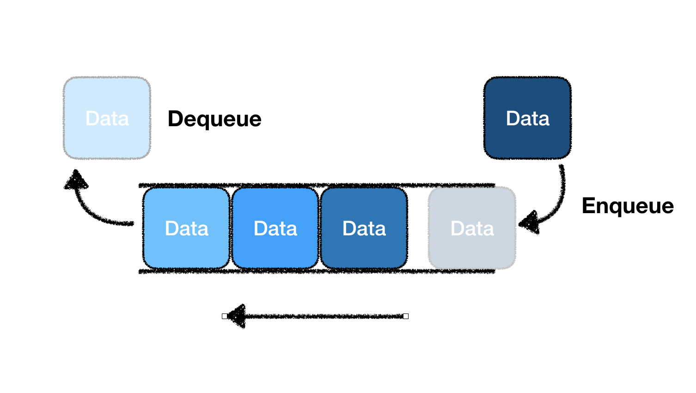

# 2021-10-07-Thu

<br/>

## 13. 큐

### 🌼 큐 개념

**`큐`** 란, 스택과는 다르게 FIFO 기반의 자료구조이다.  
즉 입력은 뒤에서 하지만, 출력은 앞에서 한다.  
먼저 들어온 순대로 먼저 나가는 것이다.  
여타 메서드들이 스택과 유사하다.

<br/>
<br/>



<br/>

이해하기 편한 큐의 그림이 있어 보면서 되새겨 보았다.  
그런데 큐는 위 그림 말고, 반대 방향으로 enqueue와 dequeue가 그려져 있는 그림이 많던데,  
이유가 뭔지 궁금하다.

<br/>

##### 이미지 출처

> https://velog.io/@sbinha/%EC%8A%A4%ED%83%9D-%ED%81%90

<br/>
<br/>
<br/>
<br/>

### 🌼 큐 구현

#### 🌷 Queue 생성자 함수

```js
function Queue(array) {
  this.array = array ? array : [];
}
```

들어온 배열이 있다면 배열 자체를, 없다면 빈 배열로 큐를 설정한다.

<br/>
<br/>

#### 🌷 getBuffer() 메서드

```js
Queue.prototype.getBuffer = function () {
  return this.array.slice();
};
```

`this.array.slice()`를 해서 배열의 얇은 복사를 하여,  
큐의 프로퍼티인 배열 전체를 반환해서 큐의 요소들을 알 수 있게 한다.

<br/>
<br/>

#### 🌷 isEmpty() 메서드

```js
Queue.prototype.isEmpty = function () {
  return this.array.length === 0;
};
```

큐의 길이가 0인지 검사하고, 빈 큐인지 확인한다.

<br/>
<br/>

#### 🌷 enqueue(element) 메서드

```js
Queue.prototype.enqueue = function (element) {
  return this.array.push(element);
};
```

인자로 받은 요소를 큐에 push한다.  
`enqueue` 메서드는 **스택과 같이 맨 뒤에 요소를 넣으므로** 스택의 push() 메서드와 같다.

<br/>
<br/>

#### 🌷 dequeue() 메서드

```js
Queue.prototype.dequeue = function () {
  return this.array.shift();
};
```

큐의 가장 앞의 요소를 꺼내서 삭제하고, 그 값을 반환한다.  
배열의 `shift()` 메서드를 빌려 쓴다.

<br/>
<br/>

#### 🌷 front() 메서드

```js
Queue.prototype.front = function () {
  return this.array.length === 0 ? undefined : this.array[0];
};
```

큐에 아무 요소가 없으면 `undefined`를 반환하고,  
요소가 있다면 첫 번째 요소를 반환한다.

<br/>
<br/>

#### 🌷 size() 메서드

```js
Queue.prototype.size = function () {
  return this.array.length;
};
```

큐의 길이를 반환하여 몇 개의 요소가 있는지 확인한다.

<br/>
<br/>

#### 🌷 clear() 메서드

```js
Queue.prototype.clear = function () {
  this.array = [];
};
```

큐를 비워 초기 상태로 되돌린다. 즉 큐를 빈 배열로 만든다.

<br/>
<br/>
<br/>
<br/>

### 🌼 큐 최적화 하기

특히 `enqueue()`, `dequeue()` 메서드에 관련된 이야기이다.  
우리는 배열의 `push()`, `pop()`, `shift()` 메서드로  
손쉽게 스택과 큐의 맨 앞과 맨 뒤의 요소를 추가/삭제할 수 있었다.

<br/>

이 중 `shift()` 메서드는 알고리즘의 시간 복잡도가 `O(n)`으로,  
`push()` 메서드의 시간 복잡도인 `O(1)`보다 높다고 할 수 있다.  
이는 데이터의 개수가 많아질 수록 차이가 확연하게 드러난다.  
그러므로 우리는 `enqueue()` 메서드와 `dequeue()` 메서드의 구현 방식을  
index와 관련된 방법으로 바꿔서 할 필요가 있다.  
그렇게 해서 O(1)의 시간 복잡도를 가지게 할 수 있다.  
그 방식은 아래와 같이 한다.

<br/>
<br/>

#### 🌻 Queue 생성자 변경

```js
function Queue(array) {
  this.array = array ? array : [];
  this.tail = array ? array.length : 0;
  this.head = 0;
}
```

<br/>

일단 위와 같이, **`Queue` 생성자 함수**의 프로퍼티에 `tail`과 `head`를 추가한다.  
`head`는 0으로 초기화하고,  
`tail`은 생성자 함수 안에 값이 있는 경우 `array.length`를, 없으면 0으로 초기화한다.

<br/>
<br/>
<br/>

#### 🌻 enqueue() 메서드 변경

```js
Queue.prototype.enqueue = function (element) {
  return (this.array[this.tail++] = element);
};
```

<br/>

**`enqueue()` 메서드**는 큐의 가장 뒤에 요소를 추가하는 메서드인데,  
이제 index를 활용하여 접근하는 방식을 채택하기로 했으므로  
배열의 `tail` 인덱스를 `element` 값으로 변경한다.  
단, 인덱스는 `this.tail++`로 지정해두어 `this.tail`이 한 칸 더 뒤로 가도록 한다.

<br/>

원래 이 `tail`은 위 생성자 함수의 프로퍼티 설정에 의해  
`array.length` 이므로, 만약 큐에 1, 2, 3이 들어와 있다면  
**3 다음의 자리가 tail이다.**  
이렇게 설정해서 계속 요소를 넣을 자리를 tail이 가리키고 있는 것이다.

<br/>

이 부분에서는 스택의 push()와 다르게 작성한다고 할 수 있겠다.  
스택은 값이 들어있는 스택의 가장 마지막 요소를 가리키고,  
큐는 값이 '들어갈' 가장 마지막의 빈 자리를 가리키기 때문이다.

<br/>
<br/>
<br/>

#### 🌻 dequeue() 메서드 변경

```js
Queue.prototype.dequeue = function () {
  if (this.tail === this.head) return undefined;

  let element = this.array[this.head];
  delete this.array[this.head++];
  return element;
};
```

<br/>

**`dequeue()` 메서드**는 맨 앞의 요소를 뺀다.  
**만약 `tail`과 `head`가 같은 경우**는 `undefined`를 반환하는데,  
이는 큐에 아무 요소도 없음을 뜻한다.

<br/>

큐의 `head` 인덱스에 접근한 값을 `element` 변수에 저장해두고,  
해당 값을 큐에서 삭제한다. 이 이후에는 head 인덱스가 증가하게 된다.  
그리고 저장해두었던 `element` 값을 반환한다.

<br/>
<br/>

🌞 **궁금한 점**은, `delete` 키워드를 활용해서 요소를 삭제하고,  
head를 계속 증가시켜주게 되면  
큐의 길이는 빈 요소를 포함하게 될테고,  
head는 0이 아니라 dequeue() 메서드를 쓰는 횟수에 따라  
계속 뒤로 밀려날텐데, 이렇게 해도 문제가 없는지 궁금하다.  
큐에서 인덱싱을 활용하여 요소를 삽입하고 삭제하는 과정을 만드려면  
이렇게 인덱스 수만 조절해서 옮기는 방법 밖에는 없는지..
이 부분에 대해서는 내일 질문드려 봐야겠다!  
답변을 받고 더 알게 되면 메모하러 오자!  
혹시 모르니 다음 챕터인 우선순위 큐, 원형 큐에 대해 수강해보고 질문하기. 🖐

<br/>
<br/>

🌕 **궁금한 점을 해결**했다! (✔ 10-08)  
일단 **자바스크립트 배열**은 배열을 모방한 희소 배열 객체이고,  
이로 인해 `delete` 키워드를 쓰게 되면 empty 요소가 남게 되고,  
그에 따른 길이 조정이나 인덱싱 접근이 곤란해진다.  
그러므로 배열에서는 최대한 `delete` 키워드를 제외한 내장 메서드를 쓰는 것이 바람직하다.  
하지만 경험해본 바 **`원형 큐`에 한정**해서는, empty 요소가 남더라도  
`length` 길이를 조절하여 정상적으로 크기를 알 수 있고,  
`head`와 `tail`이 무조건 처음과 끝 인덱스가 아니더라도  
뱅글뱅글 돌면서 삭제할 요소와 추가할 요소의 자리를 찾아가기도 하고,  
`empty` 자리가 `tail`일 때 `enqueue` 메서드를 사용하면  
요소가 새로운 다른 값으로 대체될 수 있으므로 사용하는 데에 큰 문제가 없었다.  
메모메모! 🖐

<br/>
<br/>
<br/>
