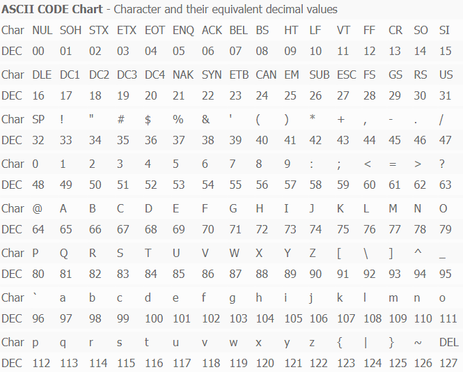
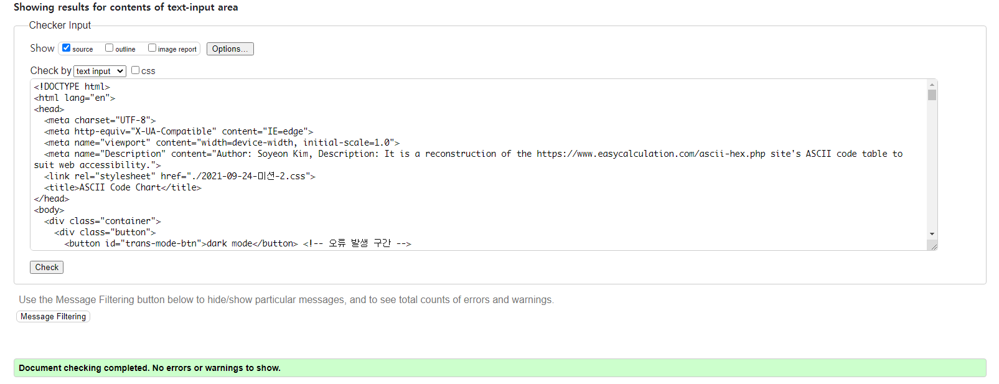
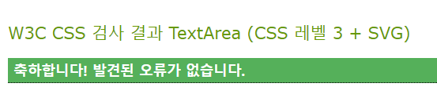
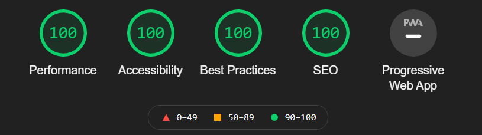
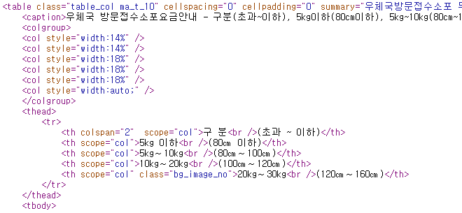

# 2021-09-24-Fri

<br/>

## 미션-2, 접근성 높은 데이터 테이블 제작하기

### 🌴 1. 접근성이 좋지 않은 테이블이 있는 웹페이지 선정

데이터 테이블이 있으면서 접근성이 좋지 않은 웹페이지를 찾아다녔다.  
떠오르는 웹사이트가 없어 정말 인터넷 세상을 탐험했는데,  
아무래도 많은 사용자를 거느리고 있는 사이트들은  
웹 접근성을 고려한 데이터 테이블을 가진 경우가 많았다.

<br/>

생각나는 대로 웹사이트를 이것저것 뒤져보던 중,  
문자를 아스키코드, 2진수, 16진수로 변환해주는 사이트를 발견했다.  
문제는 그 아래에 있는 아스키 코드 차트였는데,  
가독성도 매우 떨어질 뿐더러 웹 접근성을 고려하지 않았음을 발견했다.  
선정하게 된 사이트는 **https://www.easycalculation.com/ascii-hex.php** 이다.

<br/>
<br/>

---

<br/>
<br/>

### 🌳 2. 웹표준 준수 및 웹 접근성 관점에서 기존 서비스의 문제점 분석

1번에서 언급했던 사이트의 아스키 코드 차트의 화면은 아래와 같다.

<br/>



<br/>
<br/>
<br/>

물론 이 사이트의 본질적인 서비스는  
문자를 입력하면 변환된 아스키 코드를 보여주는 데에 있지만,  
아스키 코드 차트도 첨부된 자료이므로  
웹 접근성을 고려해야 했음이 맞는 방향일 것이다.

<br/>

사실, 눈으로 봤을 때 가독성이 매우 떨어진다는 것을 제외하면  
웹 접근성을 고려했는지 정확하게 판단할 수 없어 해당 페이지의 코드를 참고했다.  
아래는 아스키 코드 차트 테이블의 일부이다.

<br/>

```html
<table>
  <tr>
    <td colspan="17">
      <b>ASCII CODE Chart</b>
    </td>
  </tr>
  <tr>
    <td>Char</td>
    <td>NUL</td>
    <td>SOH</td>
    <td>STX</td>
    <td>ETX</td>
    <td>EOT</td>
    <td>ENQ</td>
    <td>ACK</td>
    <td>BEL</td>
    <td>BS</td>
    <td>HT</td>
    <td>LF</td>
    <td>VT</td>
    <td>FF</td>
    <td>CR</td>
    <td>SO</td>
    <td>SI</td>
  </tr>
  <tr>
    <td>DEC</td>
    <td>00</td>
    <td>01</td>
    <td>02</td>
    <td>03</td>
    <td>04</td>
    <td>05</td>
    <td>06</td>
    <td>07</td>
    <td>08</td>
    <td>09</td>
    <td>10</td>
    <td>11</td>
    <td>12</td>
    <td>13</td>
    <td>14</td>
    <td>15</td>
  </tr>
</table>
```

<br/>

스크린리더가 읽을 수 있는 `scope`부터 해서,  
`caption`, `colgroup` 등이 아무 것도 쓰이지 않았다.  
`Char` 행과 `DEC` 행이 같은 색상으로 번갈아 연속적으로 나오면서  
행과 열을 동시에 찾아가야 하므로 불편했다.

<br/>

또한 아래와 같이 레이아웃을 위한 테이블 요소를 사용하였고,  
빈 셀에 대해 웹 접근성을 고려하지 않았다.

```html
<tr align="center">
  <td></td>
  <td></td>
  <td></td>
  <td></td>
  <td></td>
  <td></td>
  <td></td>
  <td></td>
  <td></td>
  ...
  <td></td>
</tr>
```

<br/>
<br/>

---

<br/>
<br/>

### 🌲 3. 해당 이슈를 WCAG 가이드라인에 맞춰 수정 계획 선정

바꾸고자 하는 레이아웃을 WCAG 가이드라인에 맞춰 수정하려 한다.  
우선, 데이터 테이블에서 오디오나 비디오, 텍스트가 아닌 요소(이미지 등)가 없어  
대부분 권고된 WCAG 가이드라인에서 제외되는 경우가 많았다.  
광과민성증후군을 가지고 있는 사용자를 위해 `다크모드/라이트 모드`도 구현하려고 한다.

<br/>
<br/>

🌻 **Guideline 1.3 Adaptable**  
**Success Criterion 1.3.2 Meaningful Sequence**  
When the sequence in which content is presented affects its meaning, a correct reading sequence can be programmatically determined.

<br/>

컨텐츠가 표시되는 순서가 그것의 의미에 영향을 준다면,  
올바른 읽기 순서는 프로그래밍적으로 결정되어야한다.  
테이블을 읽어나가는 순서에 맞게 작성해야 한다.

<br/>
<br/>
<br/>
<br/>

🌻 **Guideline 1.4 Distinguishable**  
**Success Criterion 1.4.4 Resize text**  
Except for captions and images of text, text can be resized without assistive technology up to 200 percent without loss of content or functionality.

<br/>

텍스트의 크기가 보조기기, 컨텐츠 손상 없이 최대 200%까지 조정이 가능해야 한다.  
**이 부분과 관련된 수정 계획은 '큰 글자 모드 버튼' 만들기이다.**

<br/>
<br/>
<br/>
<br/>

🌻 **Guideline 2.1 Keyboard Accessible**  
Make all functionality available from a keyboard.

<br/>

모든 기능을 키보드로 가능하게끔 해야한다.  
아스키 코드 차트에서 수직 스크롤이 필요하다면,  
아래 방향키를 누르면 스크롤링이 되긴 하지만  
이동하는 스크롤 길이가 길지 않아 이것을 더 편리하게 구현해볼 예정이다.  
예를 들어 아래 방향키를 누르면 스크롤 이동 길이를 지정해주는 것이다.

<br/>
<br/>
<br/>
<br/>

**🌻 Guideline 2.4 Navigable**  
**Success Criterion 2.4.2 Page Titled**  
Web pages have titles that describe topic or purpose.

<br/>

웹 페이지는 주제와 목적을 설명할 수 있는 제목이 있어야 한다.

<br/>
<br/>
<br/>
<br/>

**🌻 Guideline 3.1 Readable**  
**Success Criterion 3.1.4 Abbreviations**  
A mechanism for identifying the expanded form or meaning of abbreviations is available.

<br/>

약어의 원래 의미를 인식할 수 있는 메커니즘이 있어야 한다.  
처음 아스키 코드 차트를 봤을 때, 00번인 NUL은 NULL로 읽을 수 있었지만,  
그 뒤의 VT, SO 등은 이해하기 어려우므로  
이와 같은 약어로 표현된 문자들은  
데이터 테이블에 `Description` 열을 추가해서 원래의 뜻을 알려줄 수 있도록 할 것이다.

<br/>
<br/>

---

<br/>
<br/>

### 🎄 4. 웹 접근성 관련 체크리스트 작성

**1. caption 사용하기**  
 표의 제목, 설명 등이 들어가지만 화면에는 나타나지 않게 한다.  
 이것 조차 웹 접근성을 고려한 방법으로 해야 한다.  
 즉 `display: none` 등을 사용하지 않아야 한다.  
 테이블의 첫번째 자식으로 사용한다.

<br/>

**2. scope 속성 사용하기**  
 `<th>` 태그의 방향성을 알려준다.  
 즉 `<th scope="col">`이면 세로 방향의 항목을 가리킨다.  
 더해서, `colgroup` 등으로 셀 병합을 알려주어야 한다.  
 HTML5에서 `<td>` 태그의 scope 속성은 표준이 아니다.

<br/>

**3. `<thead>`, `<tbody>`, `<tfoot>` 사용하기**  
 `tbody`를 베이스로 `<thead>`, `<tfoot>`은 선택적이나,  
 모두 사용하는 경우 `<tbody>`보다 `<tfoot>`을 먼저 선언한다.  
 스크린 리더로 읽을 시 `<tbody>`의 크기가 크면  
 `<tfoot>`에 도달하는 데까지 시간이 오래 걸리기 때문이다.

<br/>
<br/>

---

<br/>
<br/>

### 🌿 5. HTML/CSS를 활용하여 구현

<br/>

##### 1. 코드의 길이를 고려하여 대부분을 중략하여 포함한다.

##### 2. 각 하이퍼링크를 클릭하면 해당 파일로 이동할 수 있다.

##### 3. 파일의 코드들이 모두 포함된 폴더는 다음의 경로에 있다.

> https://github.com/soya-s2/zerobase-TIL/tree/master/mission-2

<br/>
<br/>

#### 🌱 [미션-2.html](./2021-09-24-미션-2.html)

```html
<!DOCTYPE html>
<html lang="en">
  <head>
    <meta charset="UTF-8" />
    <meta http-equiv="X-UA-Compatible" content="IE=edge" />
    <meta name="viewport" content="width=device-width, initial-scale=1.0" />
    <meta
      name="Description"
      content="Author: Soyeon Kim, Description: It is a reconstruction of the https://www.easycalculation.com/ascii-hex.php site's ASCII code table to suit web accessibility."
    />
    <link rel="stylesheet" href="./2021-09-24-미션-2.css" />
    <title>ASCII Code Chart</title>
  </head>
  <body>
    <div class="container">
      <div class="button">
        <button id="trans-mode-btn">dark mode</button>
        <!-- 오류 발생 구간 -->
        <button id="bigger-text-btn">bigger text</button>
        <button id="go-top-btn">TOP</button>
      </div>
      <div class="table">
        <table>
          <caption id="table-caption">
            ASCII Code Chart
          </caption>
          <colgroup>
            <col style="width: 140px" />
            <col style="width: 140px" />
            <col style="width: 130px" />
            <col style="width: 214px" />
            <col style="width: 143px" />
            <col style="width: 408px" />
          </colgroup>
          <thead>
            <tr>
              <th scope="col" class="th">DEC</th>
              <th scope="col" class="th">OCT</th>
              <th scope="col" class="th">HEX</th>
              <th scope="col" class="th">BINARY</th>
              <th scope="col" class="th">CHAR</th>
              <th scope="col" class="th">Description</th>
            </tr>
          </thead>
          <tbody>
            <tr>
              <td>0</td>
              <td>000</td>
              <td>00</td>
              <td>00000000</td>
              <td>NUL</td>
              <td>Null char</td>
            </tr>

            ...

            <tr>
              <td>127</td>
              <td>177</td>
              <td>7F</td>
              <td>01111111</td>
              <td></td>
              <td>Delete</td>
            </tr>
          </tbody>
        </table>
      </div>
    </div>
    <script src="./2021-09-24-미션-2.js"></script>
  </body>
</html>
```

<br/>
<br/>

#### 🌱 [미션-2.css](./2021-09-24-미션-2.css)

```css
@import url("https://fonts.googleapis.com/css2?family=Lato&family=Open+Sans:wght@500&family=Poppins&display=swap"); /* normal */

/* Set media query */
/* https://gist.github.com/gokulkrishh/242e68d1ee94ad05f488 */

/* 
  ##Device = Desktops
  ##Screen = 1281px to higher resolution desktops
*/
@media (min-width: 1600px) {
  table {
    width: 1400px;
  }
}

...

/* 
  ##Device = Most of the Smartphones Mobiles (Portrait)
  ##Screen = B/w 320px to 479px
*/

@media (min-width: 320px) and (max-width: 480px) {
  * {
    font-size: 14px;
  }
  table {
    width: 200px;
  }
  #trans-mode-btn,
  #bigger-text-btn,
  #go-top-btn {
    width: 80px;
    height: 80px;
    font-size: 19px;
  }
}

html {
  scroll-behavior: smooth;
}

* {
  font-family: "Open Sans", sans-serif;
}

*:not(button) {
  transition: background-color 0.7s ease-in, color 0.6s ease-in-out;
}

.container {
  position: relative;
  width: 100%;
}

table {
  margin: 3% auto;
  border-collapse: collapse;
}

table caption {
  margin-bottom: 5%;
  font: bolder 3em "Open Sans", sans-serif;
}

table thead {
  position: sticky;
  top: 5%;
}

... #go-top-btn {
  right: 2%;
  bottom: 5%;
  background-color: black;
}

#go-top-btn:hover {
  background-color: rgb(216, 216, 216);
  color: black;
  transition: all 0.5s ease;
}
```

<br/>
<br/>

#### 🌱 [미션-2.js](./2021-09-24-미션-2.js)

```js
const body = document.querySelector("body");
const table = document.querySelector("table");
const caption = document.querySelector("caption");
const thead = document.querySelector("thead");
const tbody = document.querySelector("tbody");
const tr = document.querySelectorAll("tbody tr");
const td = document.querySelectorAll("tbody td");
const trans_mode_btn = document.getElementById("trans-mode-btn");
const trans_mode_btn_style = trans_mode_btn.style;
const bigger_text_btn = document.getElementById("bigger-text-btn");
const go_top_btn = document.getElementById("go-top-btn");

for (let i = 0; i < tr.length; i++) {
  if (i % 2 === 1) {
    tr[i].classList.add("odd");
  } else {
    tr[i].classList.add("even");
  }
}

const tr_odd = document.querySelectorAll("tbody .odd");
const tr_even = document.querySelectorAll("tbody .even");

let trans_mode_btn_click = function () {
  if (trans_mode_btn.innerText === "dark mode") {
    body.style.backgroundColor = "#2b2b2b";
    caption.style.color = "white";
    trans_mode_btn.innerText = "light mode";
    trans_mode_btn_style.backgroundColor = "#eee";
    trans_mode_btn_style.color = "black";
    for (let i = 0; i < td.length; i++) {
      td[i].style.border = "1px dotted #dedede";
    }
    for (let i = 0; i < tr_odd.length; i++) {
      tr_odd[i].style.backgroundColor = "#9c9c9c";
    }
    for (let i = 0; i < tr_even.length; i++) {
      tr_even[i].style.backgroundColor = "#b5b5b5";
    }
  } else {
    body.style.backgroundColor = "white";
    caption.style.color = "black";
    trans_mode_btn.innerText = "dark mode";
    trans_mode_btn_style.backgroundColor = "rgb(65, 65, 65)";
    trans_mode_btn_style.color = "white";
    for (let i = 0; i < td.length; i++) {
      td[i].style.border = "1px dotted rgb(155, 155, 155)";
    }
    for (let i = 0; i < tr_odd.length; i++) {
      tr_odd[i].style.backgroundColor = "rgb(241, 241, 241)";
    }
    for (let i = 0; i < tr_even.length; i++) {
      tr_even[i].style.backgroundColor = "white";
    }
  }
};

trans_mode_btn.addEventListener("click", trans_mode_btn_click);

let go_top_btn_click = function () {
  window.scrollTo(0, 0);
};

go_top_btn.addEventListener("click", go_top_btn_click);

let bigger_text_btn_click = function () {
  if (bigger_text_btn.innerHTML === "bigger text") {
    bigger_text_btn.classList.remove("bigger");
    bigger_text_btn.innerHTML = "normal text";
    table.style.width = "1700px";
    thead.style.fontSize = "3em";
    tbody.style.fontSize = "3em";
  } else {
    bigger_text_btn.classList.add("bigger");
    bigger_text_btn.innerHTML = "bigger text";
    thead.style.fontSize = "2em";
    tbody.style.fontSize = "2em";
  }
};

bigger_text_btn.addEventListener("click", bigger_text_btn_click);
```

<br/>
<br/>

---

<br/>
<br/>

### 🍀 6. 문법 검사 결과

<br/>

##### 1. HTML 문법 검사는 https://validator.w3.org/nu/#textarea 에서 하였다.

##### 2. CSS 문법 검사는 https://jigsaw.w3.org/css-validator/ 에서 하였다.

<br/>
<br/>

#### 🍃 HTML 문법 검사 결과

<br/>



<br/>
<br/>
<br/>
<br/>

#### 🍃 CSS 문법 검사 결과



<br/>
<br/>
<br/>
<br/>

---

<br/>
<br/>

### 🍃 7. 라이트하우스에서의 접근성 및 SEO 관련 분석 리포트



<br/>
<br/>
<br/>
<br/>

---

<br/>
<br/>

### 🌵 8. 프로젝트 완료 후기

프로젝트 완료 후기에 앞서, 접근성 높은 데이터 테이블의 예시를 보고  
이 테이블이 왜 좋은 사례가 될 수 있었는지 생각해보았던 점을 써본다.

<br/>
<br/>

#### 🎄 왜 예시 사례는 접근성이 높은 데이터 테이블일까?

<br/>



<br/>
<br/>

해당 페이지의 페이지 소스보기로 코드 확인이 가능했는데,  
일단 웹 접근성에 부합하게 `colgroup` 태그와  
`summary`, `scope` 속성과 그 값을 을 적절히 사용했다는 점에서  
우수 사례가 될 수 있다고 생각하였다.

<br/>

또한 경험적으로는 처음 접속하는 사용자라도  
데이터 테이블을 매끄럽게 읽어나갈 수 있다는 점에서도 그러하였다.

<br/>
<br/>
<br/>

#### 🎄 시행 착오

처음에 데이터 테이블의 접근성이 좋지 않은 사이트를 찾으려고 했더니,  
어디서부터 어떻게 찾아야할지 막막했다.  
처음 만들어진 웹사이트를 찾아보기도 했으나 무슨 이유에선지 접속이 불가했고  
이용자가 많은 순으로 정렬된 사이트를 차례로 접속해서 코드를 확인했더니,  
위에서 언급한 웹 접근성을 모두 고려한 사이트였다.

<br/>

그러다가 예전에 공부할 때 아스키코드 표를 굉장히 보기 불편했던 사이트가 생각나 찾아보니,  
해당 코드에서도 접근성을 전혀 고려하지 않고 있음을 확인했고,  
확인해야 하는 가이드라인을 알려주셔서 어떻게 바꿀지 결정할 수 있었다.

<br/>
<br/>
<br/>

#### 🎄 < 3. WCAG 가이드라인 >, < 4. 웹 접근성 관련 체크리스트 >를 준수했는가?

<br/>

**1.** 광과민성증후군을 위한 **다크모드 / 라이트모드 버튼**을 만들었다.

<br/>

**2.** PC / 모바일 **기기간 크기 변화를 고려**하였다.  
(하지만 미디어쿼리문 작성이 힘들었고, 깃허브를 참고하였다.  
해당 깃허브 주소는 코드 내부에 첨부하였다.)  
그리고 사실상 크기 변화만 고려했을 뿐  
요소들의 크기를 어떻게 조금 더 편리하고 정확한 방법으로 조절할 수 있는지 모르겠다.

<br/>

**3.** 테이블을 읽어나가는 순서를 프로그래밍적으로 결정하였다. **(scope를 사용)**

<br/>

**4.** 컨텐츠 손상 없이 텍스트의 크기를 조정할 수 있도록  
**`bigger text` 버튼**을 만들었고,  
**다시 버튼을 누르면 원래의 텍스트 크기로 돌아갈 수 있도록 하였다.**

<br/>

**5.** 모든 기능은 키보드로 작동이 가능해야 하므로,  
세로방향으로 긴 데이터 테이블을 키보드로 이동이 용이하게 하려면  
키보드 방향키로 한 번에 스크롤링 가능한 크기를 조절해줘야 했다.  
수행해야 할 다른 강의나 과제들도 많아, 시간관계상 구현하지 못해서 아쉽다.  
예상하기로는 아래 방향키를 누르는 키보드 이벤트 리스너를 만들어서,  
scroll의 크기를 조정해주면 되지 않을까라는 생각을 해본다.

<br/>

**6.** 주제와 목적을 설명하는 제목인 `ASCII Code Chart`를  
페이지 맨 위에 표시하였다. 이것은 **`caption`** 태그로 작성되었다.

<br/>

**7.** 약어의 원래 의미를 인식할 수 있는 메커니즘이 필요하다.  
STX, LF 같은 약어는 일반인들이 보기에 이해하기 힘들 수 있어,  
데이터 테이블의 **마지막 열에 `Description` 열을 추가**하여  
**`Start of Text`, `Line Feed`와 같이 알 수 있게 하였다.**

<br/>

**8.** 웹 접근성 관련하여 **`caption`, `scope`, `thead`, `tbody` 태그를 사용하였다.**

<br/>

**+** 또한 **`<thead>`를 고정**하여 스크롤링해도 해당 열을 편리하게 확인할 수 있게 하였고,  
각 **홀수행/짝수행의 색상을 다르게 지정**하여 아래로 읽어나갈 때 구분이 용이하도록 하였다.

<br/>
<br/>
<br/>

#### 🌷 간단한 시연 영상

마지막으로, 이것저것 버튼을 눌러보고 스크롤링해보는 영상을  
GIF로 변환하여 공유하려 한다.  
기존 페이지의 데이터 테이블에서 더욱 보거나 데이터에 접근하는 것이 편했다면 좋겠고,  
웹 접근성이나 가이드라인을 잘 고려한 결과물이 맞기를 기대해본다.

<br/>
<br/>

##### 🌜 원래의 데이터 테이블

<br/>


<br/>
<br/>
<br/>
<br/>
<br/>

##### 🌛 제작한 데이터 테이블 (약 20초)


<br/>
<br/>
<br/>
<br/>

이렇게 미션-2를 마무리하며, 매우 좋은 경험을 해서 기쁘다는 말로 글을 마친다.

<br/>
<br/>
<br/>
<br/>
