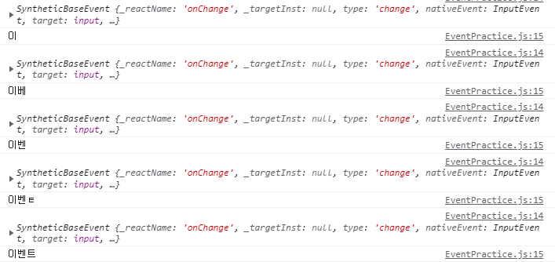

# 2021-09-23-Thu

<br/>

## 5. 이벤트 핸들링

### 🐶 개요

**사용자가 웹 브라우저에서 DOM 요소와 상호 작용하는 것이 이벤트**이다.  
이러한 **이벤트 처리를 하는 것이 `이벤트 핸들링`** 이다.

<br/>
<br/>
<br/>
<br/>

### 🐱 이벤트 사용 시 주의사항

#### 🐺 이벤트 이름은 카멜 표기법으로 작성한다.

`onClick`, `onKeyUp` 등으로 작성해야 한다.

<br/>

#### 🐺 함수 형태의 값을 전달한다.

HTML에서의 이벤트 설정은 `"onclick=alert('알림!')"`과 같이  
쌍따옴표 안에 실행할 코드를 넣었다.  
하지만 리액트에서는 함수 객체를 전달한다.  
이 함수는 바로 전달도 되고, 렌더링 외부에 미리 만들어서 전달도 가능하다.

<br/>

#### 🐺 DOM 요소에만 이벤트를 설정한다.

직접 만든 컴포넌트에는 이벤트 설정이 불가하다.  
만약 `onClick`을 설정해준다면, 이는 이벤트 핸들러 함수를 실행하는 것이 아닌  
이름이 `onClick`인 `props`를 컴포넌트에 전달하는 것이다.  
하지만 전달받은 props를 컴포넌트 내부의 DOM 이벤트로 설정 가능하다.

<br/>
<br/>
<br/>
<br/>

### 🐭 리액트에서 지원하는 이벤트 종류

- Clipboard
- Touch
- Composition
- UI
- Keyboard
- Wheel
- Focus
- Media
- Form
- Image
- Mouse
- Animation
- Selection
- Transition

<br/>
<br/>
<br/>
<br/>

### 🐹 이벤트 핸들링 실습해보기

<br/>

### 🐰 1. 컴포넌트 생성

<br/>

**src/EventPractice.js**

```jsx
import React, { Component } from "react";

class EventPractice extends Component {
  render() {
    return (
      <div>
        <h1>이벤트 연습</h1>
      </div>
    );
  }
}

export default EventPractice;
```

<br/>

**src/App.js**

```jsx
import React from "react";
import EventPractice from "./EventPractice";

const App = () => {
  return <EventPractice />;
};

export default App;
```

<br/>

EventPractice 컴포넌트를 클래스 컴포넌트로 작성하고,  
App.js 파일에서 불러왔다.

<br/>
<br/>
<br/>
<br/>

### 🐰 2. onChange 이벤트 생성과 state에 input 값 담기

```jsx
import React, { Component } from "react";

class EventPractice extends Component {
  state = {
    message: "",
  };
  // state는 컴포넌트의 내장 객체이다.

  render() {
    return (
      <div>
        <h1>이벤트 연습</h1>
        <input
          type="text"
          name="message"
          placeholder="아무거나 입력해 보세요"
          value={this.state.message} // value에 message를 설정
          onChange={(e) => {
            this.setState({
              message: e.target.value, // 입력할 때마다 message를 이벤트 타겟의 value로 변경
            });
            console.log(this);
            // EventPractice {props: {…}, context: {…}, refs: {…}, updater: {…}, state: {…}, …}
          }}
        />
        <button
          onClick={() => {
            alert(this.state.message); // 버튼을 클릭하면 state에 담긴 message를 알림
            this.setState({
              message: "", // 공백으로 초기화
            });
          }}
        >
          확인
        </button>
      </div>
    );
  }
}

export default EventPractice;
```

<br/>
<br/>

- state는 내장 객체라는 것!
  > https://homzzang.com/b/react-9

<br/>
<br/>

input 박스의 내용이 변경될 때마다 `this.state.message`의 값을 변경한다.  
이것은 `onChange` 이벤트 핸들러를 통해 이루어진다!  
그리고 확인 버튼을 누르면 `state`를 초기화한다.

<br/>
<br/>

input에 내용을 입력하면 콘솔에서 다음 내용을 확인 가능하다.

<br/>



<br/>
<br/>

`SyntheticEvent`와 `NativeEvent` 두 종류가 있는데,  
이 이벤트들은 `SyntheticEvent`에 속한다.  
둘의 차이를 아래 참고자료를 활용하여 알아보았다.  
결론적으로 전자는 브라우저마다 같은 이벤트 처리를 한다는 점.

<br/>

- SyntheticEvent와 NativeEvent에 대하여

  > https://ibocon.tistory.com/192

  > https://ipex.tistory.com/entry/React-%EB%A6%AC%EC%95%A1%ED%8A%B8%EC%9D%98-%EC%9D%B4%EB%B2%A4%ED%8A%B8-epersist-aka-SyntheticEvent-If-you-must-keep-the-original-synthetic-event-around-use-eventpersist

<br/>
<br/>
<br/>
<br/>

### 🐰 3. 임의 메서드 만들기

```jsx
import React, { Component } from "react";
class EventPractice extends Component {
  state = {
    message: "",
  };

  constructor(props) {
    super(props);
    this.handleChange = this.handleChange.bind(this);
    this.handleClick = this.handleClick.bind(this);
  }

  // 함수를 미리 만들어 전달하는 것이 가독성이 훨씬 높다.
  handleChange(e) {
    this.setState({
      message: e.target.value,
    });
  }

  handleClick() {
    alert(this.state.message);
    this.setState({
      message: "",
    });
  }

  render() {
    return (
      <div>
        <h1>이벤트 연습</h1>
        <input
          type="text"
          name="message"
          placeholder="아무거나 입력해 보세요"
          value={this.state.message}
          onChange={this.handleChange}
        />
        <button onClick={this.handleClick}>확인</button>
      </div>
    );
  }
}

export default EventPractice;
```

<br/>
  
함수가 호출될 때 this는 호출부에 따라 결정되는데,   
**클래스의 임의 메서드가 이벤트로 등록될 때 메서드와 this의 관계가 끊어진다.**   
그러므로 임의 메서드가 this를 컴포넌트 자신으로 제대로 가리키게 하기 위해서는   
**메서드를 this와 바인딩하는 작업이 필요**하고, 그렇지 않다면 undefined를 가리킨다.    
**bind() 메서드로 this를 '고정'** 시킬 수 있다.

<br/>

메서드 바인딩은 생성자 메서드에서 하는 것이 정석이기는 하다.  
하지만 새 메서드를 만들 때마다 `constructor`를 수정해야 하기 때문에 불편할 수 있다.  
이것을 해결하기 위해 바벨의 `transform-class-properties` 문법을 사용한다.  
다음 4번에서 알아보겠다.

<br/>

- bind() 메서드를 사용하면 일어나는 일!
  > https://kamang-it.tistory.com/entry/JavaScript07this-this%EB%B0%94%EC%9D%B8%EB%93%9C%ED%8E%B8bindcallapply

<br/>
<br/>
<br/>
<br/>

### 🐰 4. 바벨의 `transform-class-properties` 문법

```jsx
import React, { Component } from "react";
class EventPractice extends Component {
  state = {
    message: "",
  };

  // 바벨의 transform-class-properties 문법,
  // 화살표 함수 형태로 메서드를 정의한다.
  handleChange = (e) => {
    /* 이 부분을 변경! */
    this.setState({
      message: e.target.value,
    });
  };

  handleClick = () => {
    /* 이 부분을 변경! */
    alert(this.state.message);
    this.setState({
      message: "",
    });
  };
  render() {
    return (
      <div>
        <h1>이벤트 연습</h1>
        <input
          type="text"
          name="message"
          placeholder="아무거나 입력해 보세요"
          value={this.state.message}
          onChange={this.handleChange}
        />
        <button onClick={this.handleClick}>확인</button>
      </div>
    );
  }
}

export default EventPractice;
```

<br/>

`constructor`에서의 메서드 바인딩을 제외하고,  
이벤트 핸들러를 화살표 함수식으로 바꾼 문법이다.  
별도의 바인딩이 필요없어 편리해보인다.

<br/>
<br/>
<br/>
<br/>

### 🐰 5. input이 여러 개라면?

```jsx
import React, { Component } from "react";

class EventPractice extends Component {
  state = {
    username: "",
    message: "",
  };

  handleChange = (e) => {
    this.setState({
      [e.target.name]: e.target.value ⭐ /* 이 부분을 변경! */,
    });
  };

  handleClick = () => {
    alert(this.state.username + ": " + this.state.message);
    this.setState({
      username: "",
      message: "",
    });
  };
  render() {
    return (
      <div>
        <h1>이벤트 연습</h1>
        <input
          type="text"
          name="username" ⭐ /* 이 부분을 변경! */
          placeholder="사용자명"
          value={this.state.username}
          onChange={this.handleChange}
        />
        <input
          type="text"
          name="message" ⭐ /* 이 부분을 변경! */
          placeholder="아무거나 입력해 보세요."
          value={this.state.message}
          onChange={this.handleChange}
        />
        <button onClick={this.handleClick}>확인</button>
      </div>
    );
  }
}

export default EventPractice;
```

<br/>

input이 여러 개인 경우, e.target.name을 활용할 수 있다.  
객체 안에서 키를 []로 감싸면 []에 해당하는 레퍼런스의 실제 값이 키 값으로 사용된다.  
즉 input에서 name을 username으로 지정했을 경우,  
**`[username]: e.target.value` ->**  
**`(this.state.)username = e.target.value`가 된다.** (setState에 의해)

<br/>

결론적으로 input의 name 속성값을 변경함으로써  
그것을 e.target.name으로 활용하고, 그 이름을 `this.state.~~`으로 설정 가능하다.

<br/>
<br/>

#### 💉 추가로 다음 방식으로 엔터키를 누르면 클릭한 것과 같이 동작하게 만들 수 있다.

```jsx
// 엔터키를 누르면 handleClick() 메서드를 호출
handleKeyPress = (e) => {
  if (e.key === "Enter") { ⭐
    this.handleClick();
  }
};

...

onKeyPress={this.handleKeyPress}
```

<br/>
<br/>
<br/>
<br/>

### 🐰 6. 함수형 컴포넌트로도 구현해보기

```jsx
import React, { useState } from "react";

const EventPractice = () => {
  const [username, setUsername] = useState(""); ⭐
  const [message, setMessage] = useState(""); ⭐
  const onChangeUsername = (e) => setUsername(e.target.value); ⭐
  const onChangeMessage = (e) => setMessage(e.target.value); ⭐
  const onClick = () => {
    alert(username + ": " + message);
    setUsername("");
    setMessage("");
  };
  const onKeyPress = (e) => {
    if (e.key === "Enter") {
      onClick();
    }
  };
  return (
    <div>
      <div>
        <h1>이벤트 연습</h1>
        <input
          type="text"
          name="username"
          placeholder="사용자명"
          value={username}
          onChange={onChangeUsername}
        />
        <input
          type="text"
          name="message"
          placeholder="아무거나 입력해 보세요."
          value={message}
          onChange={onChangeMessage}
          onKeyPress={onKeyPress}
        />
        <button onClick={onClick}>확인</button>
      </div>
    </div>
  );
};

export default EventPractice;
```

<br/>

함수형 컴포넌트로 구현하기 위해 `useState`와 `setter`를 사용하였다.  
`setter`로 `state`를 변경하기 때문에 `this.state` 키워드를 쓰지 않고,  
이벤트 핸들러에 함수명만 지정해준 것이다.

<br/>
<br/>
<br/>
<br/>

### 🐰 7. useState에 문자열이 아닌, 객체 넣어보기

```jsx
const [form, setForm] = useState({
  username: "",
  message: "",
});

const { username, message } = form;
const onChange = (e) => {
  const nextForm = {
    ...form, // ⭐ 기존 form 내용을 여기에 복사한다.
    [e.target.name]: e.target.value, // ⭐ 원하는 값을 덮어 씌운다.
    //
  };
  setForm(nextForm); // ⭐ form 값을 덮어 씌운다.
};
const onClick = () => {
  alert(username + ": " + message);
  setForm({
    username: "",
    message: "",
  });
};
```

<br/>

6번의 `useState`에 문자열이 아니라 객체를 넣어보았다.  
이것은 input의 값이 여러 개인 것을 고려해서이다.

<br/>

`form` 객체에 `username`, `message` 키를 넣고  
그 `form`을 변경할 함수로 `setForm`을 지정했다.  
_객체 형식의 state를 변경할 때, 그냥 변경하면 안 된다._  
**기존 객체 사본을 복사한 뒤, 원하는 값만 덮어 씌워야 한다.**

<br/>

갑자기 왜 그냥 변경하면 안되는지 궁금해졌는데,  
이는 불변성과 관련 있어 보인다.  
내일 관련 내용에 대해 공부를 해봐야겠다.

<br/>
<br/>
<br/>
