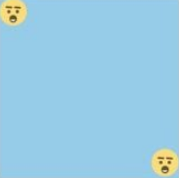
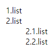
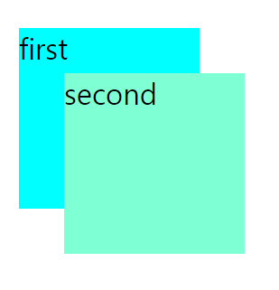

# 2021-09-14

<br/>

## 9월 9일 정기테스트 복습하기

### 🍏 CSS 우선순위

1. 속성 값 뒤에 **!important** 를 붙인 속성
2. HTML에서 **style을 직접 지정**한 속성
3. **#id** 로 지정한 속성
4. **.클래스, :추상클래스** 로 지정한 속성
5. **태그이름** 으로 지정한 속성
6. 상위 객체에 의해 **상속**된 속성

<br/>
<br/>
<br/>
<br/>

### 🍎 `meta` 태그란?

웹서버와 클라이언트 간의 **교환되는 정보에 대한 데이터**를 나타낸다.  
눈에 보이지는 않지만, 페이지를 요약하거나 언어 정보 등  
많은 정보를 나타내는 데 쓸 수 있다.

<br/>
<br/>
<br/>
<br/>

### 🍐 class="check"로 되어 있는 모든

### `<input type="checkbox">` 요소를 선택해보자.

input[type="checkbox"].check

<br/>
<br/>
<br/>
<br/>

### 🍊 ★★ flex를 써서 이모티콘을 배치해보자! ★★



<br/>
<br/>

귀여운 이모티콘 두 개를 `flex`로 위처럼 배치하려면,  
우측 하단에 있는 이모티콘의 스타일은 어떻게 지정해야 할까?

<br/>

일단 이모티콘들을 감싸고 있는 **컨테이너의 스타일을 `display: flex`로 지정**한다.  
그리고 `justify-content: space-between`으로 지정하면  
컨테이너의 양 끝에 여백 없이 컨텐츠들이 붙게 된다!

<br/>

이후 두번째 아이템에  
**`div:nth-child(2) { align-self: flex-end }`를 지정**해주면 된다.  
`align-self`는 현재 주축이 가로축인데 반해,  
세로 축에서의 각 아이템의 위치를 정하게 된다.  
교차축의 `flex-end`는 맨 아래쪽을 향하고 있으므로,  
두 번째 이모티콘은 주축에서는 맨 오른쪽이면서 교차축에서는 맨 아래쪽인  
우측 하단에 위치하게 된다.

<br/>

**`div:nth-child(2)`는 두번째 자식인 div 요소를 선택하게 된다.**

```html
<div class="flex">
  <span>1</span>
  <div>2</div>
</div>
```

위와 같은 코드에서, **두번째 자식인 div는 컨텐츠가 2인 div**이다!  
하지만 `.flex` 클래스를 가진 div 요소의 형제 요소에도 div 요소가 있다면,  
그것 또한 선택된다!  
아마 이 때 인식되는 div의 부모는 `body`가 될 것이다.

<br/>

이 부분이 궁금해서 오래 고민했는데,  
학습 매니저님께서 명쾌한 답변을 해주셔서 궁금증이 잘 해결되었다.  
묵은 때가 쓱..벗겨지는 기분!

<br/>
<br/>
<br/>
<br/>

### 🍋 스타일 적용 우선순위 (방법에 따라)

**1.** 태그 안에 인라인으로 지정한 style  
**2.** `<head>` 요소안의 style 요소  
**3.** `<style>` 요소안의 @import 문  
**4.** `<link>` 요소로 연결된 CSS 파일  
**5.** `<link>` 요소로 연결한 CSS 파일 안의 @import 문  
**6.** 최종 사용자가 연결한 CSS 파일  
**7.** 브라우저의 기본 스타일시트

<br/>
<br/>
<br/>
<br/>

### 🍌 `counter`에 대해 알아보자!



<br/>

위와 같이 주 리스트 번호와, 부 리스트 번호를 만들어보자!

<br/>
<br/>

```html
<head>
  <meta charset="UTF-8" />
  <meta http-equiv="X-UA-Compatible" content="IE=edge" />
  <meta name="viewport" content="width=device-width, initial-scale=1.0" />
  <title>실습</title>
  <style>
    ol {
      list-style-type: none;
    }
    ol:first-child {
      counter-reset: list sub-list;
    }
    li::before {
      content: counter(list) ".";
      counter-increment: list;
    }
    ol:nth-child(3) li::before {
      content: counter(list) "." counter(sub-list) ".";
      counter-increment: sub-list;
    }
  </style>
</head>
<body>
  <ol>
    <li>list</li>
    <li>list</li>
    <ol>
      <li>list</li>
      <li>list</li>
    </ol>
  </ol>
</body>
```

<br/>

일단 원래 `ol`의 속성에 있던 **`list-style-type`을 없애주었다.**  
그리고 **`counter-reset: list sub-list`** 를 통해  
카운터의 이름들을 지정해준다.

<br/>

**처음 리스트::before**에는 `content: counter(list) ".";`를 지정하여,  
`1.list`와 같이 표현되도록 하였다.

<br/>

**부 리스트::before**에는 `content: counter(list) "." counter(sub-list) ".";`을 지정하여  
`2.1.list`와 같이 표현되도록 하였다.

<br/>

**`counter-increment`로 증감시킬 카운터의 이름을 지정**한다.  
`counter-increment: sub-list / 2;`와 같이 지정해서 2씩 증가하도록도 만들 수 있다.

<br/>

카운터에 `counter(list, <style>)`을 지정해서,  
_`list-style` 속성도 지정할 수 있다!_

<br/>

> https://developer.mozilla.org/en-US/docs/Web/CSS/counter()

> https://aboooks.tistory.com/262

<br/>
<br/>
<br/>
<br/>

### 🍉 `clip-path` 속성

속성값에 무언가를 설정하면, 그 설정값 이외의 범위에는  
컨텐츠가 그려지지 않는다.

<br/>

값에는 `margin-box`, `border-box`, `padding-box`, `content-box`와 같은  
`background-origin`과 같은 속성값들을 쓸 수 있고,  
`circle`, `polygon`, `path`와 같은 값들을 지정해서 쓸 수도 있다.

<br/>
<br/>
<br/>
<br/>

### 🍇 `@media`의 미디어 쿼리 종류

모든 장치에 적합한 **all**,  
인쇄물이나 출력 화면에 표시하는 **print**,  
화면을 대상으로 하는 **screen**,  
음성 합성장치를 대상으로 하는 **speech**가 있다.

<br/>
<br/>
<br/>
<br/>

### 🍓 ★★ `<script>` 태그를 이용해 외부 스크립트 로드 시,

### 페이지가 모두 파싱 된 후 실행하도록 하는 속성 `defer`에 대해 알아보자. ★★

사실 잘 모르던 속성이다.  
이번 기회에 **`defer`** 와 그 동작 원리에 대해 정확히 알아보려고 한다!

<br/>

일단 **브라우저가 실행될 때 스크립트 파일을 만나면  
HTML DOM의 생성을 멈추고 스크립트를 다운하여 실행**한다.  
그렇게 되면 해당 스크립트 파일에서는 순서 상 뒤에있는 DOM에 접근할 수 없다.

<br/>

이러한 부작용을 해결할 수 있는 방법은,  
보통 우리가 쓰는 `<script>` 태그를 `<body>` 태그 내의 가장 아래에 두는 것인데,  
이조차도 HTML 파일 용량이 큰 경우 스크립트를 다운받는 데까지 시간이 오래 걸리므로,  
페이지 자체가 느려질 수 있다.

<br/>

그래서 이 `defer` 속성을 `<script>` 태그의 속성에 추가해주면  
스크립트 파일을 백그라운드에서 다운받는다.  
**HTML 파싱을 멈추지 않고 다운받고, 실행은 파싱이 끝나고 한다!**  
스크립트의 길이에 상관 없이 작성된 순서대로 동작한다.  
_(크기가 작은 경우 다운로드는 먼저 될 수 있지만, 실행은 순서대로 한다는 것이다!)_

<br/>

이와 비슷한 속성에 **`async`** 가 있었다.  
비슷해 보이지만 무엇이 다른가 알아보았더니,  
문서 파싱과 동시에 스크립트를 백그라운드에서 다운 받고  
**다운로드가 완료되는 순간 바로 실행한다!**  
_또, 스크립트 시간이 짧은 순서대로 먼저 실행된다._

<br/>

**정리하자면, `defer`와 `async`는  
스크립트 다운 도중 문서 파싱을 멈추지 않는 데에서는 공통점이 있으며,  
`defer`는 HTML 파싱이 끝난 후 실행하고 작성 순서대로 동작하며,  
`async`는 다운로드 즉시 실행하고 시간이 짧은 것이 먼저 실행된다!**

<br/>
 
그러므로 `defer`는 HTML 문서에 의존성이 있을 때,   
`async`는 DOM 참조 등의 의존성 없이 독립적일 수 있을 때 쓰는 것이   
적절하다고 볼 수 있겠다.

<br/>

복잡하지만 처리 속도와 관련된 내용이라 신기하고 재밌었다.

<br/>

---

아래 사이트를 참고하여 공부해보았다!  
이 링크의 보관은 나의 소중한 자산이 될 것이다..★

<br/>

> https://developer.mozilla.org/ko/docs/Web/HTML/Element/script

> https://webroadcast.tistory.com/15

> https://ko.javascript.info/script-async-defer

<br/>
<br/>
<br/>
<br/>

### 🍈 `flex-grow`에 따라 값이 적절히 배분되려면?

`flex-basis`의 기본값은 `auto`이므로, flexible한 상태가 되는데,  
이 계산된 값을 제외한 영역이 `flex-grow`와 `flex-shrink`에 포함되므로  
그것에 관련 없이 비율에 따라서만 조정하고 싶다면  
**`flex-basis`의 값을 `0`으로 지정해야 한다.**

<br/>
<br/>
<br/>
<br/>

### 🍒 Stacking context (쌓임 맥락)

**1.** 엘리먼트의 순서 상 아래에 있을 수록 스태킹 컨택스트가 높다.  
**2.** z-index가 음수에 가까울 수록 스태킹 컨텍스트가 낮다.  
**3.** z-index를 선언하지 않으면 기본값은 0이다.

<br/>

**4.** z-index를 선언하지 않은 엘리먼트가  
그 아래의 z-index가 0으로 선언된 엘리먼트보다 스태킹 컨텍스트가 낮다.

```html
<head>
  <meta charset="UTF-8" />
  <title>실습</title>
  <style>
    div {
      position: fixed;
      font-size: 2em;
      width: 200px;
      height: 200px;
    }
    .first {
      background-color: aqua;
      top: 50px;
      left: 50px;
    }
    .second {
      background-color: aquamarine;
      top: 100px;
      left: 100px;
      z-index: 0;
    }
  </style>
</head>
<body>
  <div class="first">first</div>
  <div class="second">second</div>
</body>
```



<br/>
<br/>
<br/>

**5.** z-index를 0으로 선언한 엘리먼트가  
그 아래의 z-index가 0으로 선언된 엘리먼트보다 스태킹 컨텍스트가 낮다.

<br/>

위의 이미지와 결과가 동일하다.

<br/>
<br/>
<br/>
<br/>

### 🍑 `will-change` 속성에 대하여

CSS의 `transform`, `animation`의 GPU 성능과 관련된 속성이다.  
그래픽 작업들의 성능 병목 현상을 최소화 하기 위한 방법이다.

<br/>

즉 **이 속성은 브라우저에게 곧 요소에 어떤 변화가 있을지 미리 알려주어,  
최적화할 수 있게 알려주는 역할**을 한다.

<br/>

_과하게 사용하거나, 조금 더 빨리 실행하기 위해 사용하는 것은  
적절하지 못하다고 한다._

<br/>

전역 속성인 상속 관련 속성이나,  
**`transform`, `top`, `opacity` 등을 키워드 값으로 지정 가능**하다.  
_페이지가 크고 복잡하다면 스타일시트 내에 바로 작성하는 것이 적절하다!_

<br/>
<br/>
<br/>
<br/>

### 🍍 방문하지 않은 a 태그의 하이퍼링크 글자 기본 색상은 `blue`이다!

<br/>
<br/>

이렇게 9월 9일자의 2차 정기테스트 복습을 마무리한다.  
쉬운 개념도, 몰랐던 개념도 공존했지만  
다시 확인하고, 새로운 것을 알아가는 재미 굳!

<br/>
<br/>
