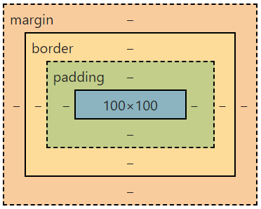
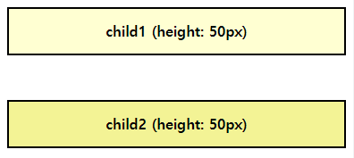
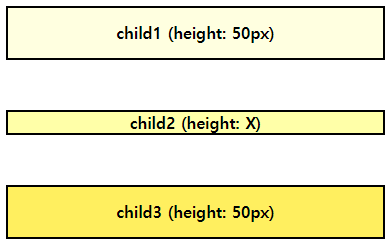
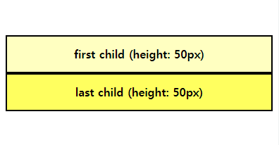
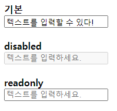
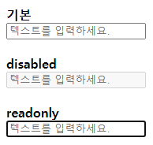

# 2021-09-16-Thu

<br/>

## 9월 13일 비정기테스트 복습하기

### 🌽 박스 모델의 구조

<br/>



<br/>
<br/>

바깥쪽부터 `margin` - `border` - `padding` - `content` 영역이다.

<br/>
<br/>
<br/>
<br/>
<br/>

### 🥕 ★★ 마진 상쇄(margin-collapsing)에 대하여 ★★

<br/>

**마진 상쇄**란 상하 마진이 겹쳐 상쇄되거나 합쳐지는 현상이다.

---

**1번 케이스.** 인접한 형제 박스 간 상하 마진이 겹칠 때, 더 큰 마진 값으로 상쇄된다.  
 이 요소들은 block 요소여야 한다.  
**2번 케이스.** 빈 요소에서 상하 마진이 겹칠 때도 더 큰 마진 값으로 상쇄된다.  
**3번 케이스.** 부모 박스와 첫 번째 자식 박스의 상단,  
 마지막 자식 박스의 하단 마진이 겹칠 때도 상쇄된다.

---

<br/>

💛 **1번**의 예를 실습해보았다.

```html
<head>
  <meta charset="UTF-8" />
  <title>실습</title>
  <style>
    .child {
      text-align: center;
      border: 2px solid black;
      height: 50px;
      line-height: 50px;
      font-weight: bold;
    }
    .child1 {
      background-color: rgb(255, 255, 210);
      margin-bottom: 50px;
    }
    .child2 {
      background-color: rgb(243, 243, 149);
      margin-top: 50px;
    }
  </style>
</head>
<body>
  <div class="parent">
    <div class="child child1">child1 (height: 50px)</div>
    <div class="child child2">child2 (height: 50px)</div>
  </div>
</body>
```

<br/>

인접한 두 형제 블록 요소 간의 겹치는 마진이 상쇄된다.  
`child1`과 `child2`의 높이는 50px로 지정하였고,  
각각의 `margin-bottom`, `margin-top` 또한 50px로 지정하여  
구별하기 쉽게 만들어 보았다.  
결론적으로 각각의 하단 마진과 상단 마진이 50px + 50px로,  
총 100px의 마진이 표시되어야 하지만, 50px가 된 것을 알 수 있다.  
만약 한 쪽의 크기가 더 컸다면, 더 큰 크기로 상쇄된다.

<br/>
<br/>



<br/>

---

<br/>

💛 **2번**의 예

```html
<head>
  <meta charset="UTF-8" />
  <title>실습</title>
  <style>
    .child {
      text-align: center;
      border: 2px solid black;
      font-weight: bold;
    }
    .child1 {
      background-color: rgb(255, 255, 224);
      margin-bottom: 50px;
      height: 50px;
      line-height: 50px;
    }
    .child2 {
      background-color: rgb(255, 255, 168);
      margin-top: 50px;
      margin-bottom: 50px;
    }
    .child3 {
      background-color: rgb(255, 255, 95);
      margin-top: 50px;
      height: 50px;
      line-height: 50px;
    }
  </style>
</head>
<body>
  <div class="parent">
    <div class="child child1">child1 (height: 50px)</div>
    <div class="child child2">child2 (height: X)</div>
    <div class="child child3">child3 (height: 50px)</div>
  </div>
</body>
```

<br/>

높이 등이 명시되어 있지 않은 (높이가 0인) 빈 요소의  
상단/하단 마진이 상쇄되었다.  
코드에서는 각 요소들마다 50px의 상/하단 마진을 지정했으나,  
빈 요소인 `child2` 요소의 상/하단 마진이 상쇄된 것을 알 수 있었다.

<br/>
<br/>



<br/>

---

<br/>

💛 **3번**의 예

```html
<head>
  <meta charset="UTF-8" />
  <title>실습</title>
  <style>
    .parent {
      text-align: center;
      /* border: 2px solid black; */
      font-weight: bold;
      margin-top: 50px;
      margin-bottom: 50px;
    }
    .child {
      border: 2px solid black;
    }
    .first {
      background-color: rgb(255, 255, 193);
      margin-top: 50px;
      height: 50px;
      line-height: 50px;
    }
    .last {
      background-color: rgb(255, 255, 95);
      margin-bottom: 50px;
      height: 50px;
      line-height: 50px;
    }
  </style>
</head>
<body>
  <div class="parent">
    <div class="child first">first child (height: 50px)</div>
    <div class="child last">last child (height: 50px)</div>
  </div>
</body>
```

<br/>

부모의 상단 마진이 첫번째 자식 요소의 상단 마진,  
부모의 하단 마진이 마지막 자식 요소의 하단 마진과 겹쳐 상쇄되었다.  
원래대로라면 상/하단에 100px의 마진이 적용되어야 하나,  
상쇄로 인해 50px만 적용된 것을 확인할 수 있다.

<br/>

더 쉽게 보기 위해 부모 박스에 border를 주어 표시하고 싶었지만,  
**`border`나 `padding`을 주게 되면 마진 상쇄 현상이 없어진다.**

<br/>
<br/>



<br/>

---

이렇게 마진 상쇄 현상이 발생하는  
3가지 케이스를 알아보고 실습해 보았다. ✌

---

<br/>
<br/>
<br/>
<br/>
<br/>

### 🥔 위의 그림에서 아래의 그림으로 변화시키려면 어떻게 해야 할까?


<br/>
<br/>

검정색 요소를 빨간색, 파란색 요소 밑으로 이동시켜야 한다.  
일단 빨간색, 파란색 요소는 아래 코드와 같이 `float` 속성이 지정돼있다.

<br/>

```html
<body>
  <header></header>
  <div class="left"></div>
  <div class="right"></div>
  <footer></footer>
</body>
```

<br/>

```html
<style>
  header {
    background-color: yellow;
    width: 100%;
    height: 50px;
  }
  .left {
    background-color: red;
    float: left;
    width: 50px;
    height: 100px;
  }
  .right {
    background-color: blue;
    float: right;
    width: 50px;
    height: 100px;
  }
</style>
```

<br/>

`float` 속성이 지정된 요소에 검정색 요소가 붙지 않도록,  
float을 `clear`해줘야 한다.  
그렇게 되면 그 뒤의 순서 요소가 달라붙지 않는다.

<br/>

---

<br/>

```css
footer {
  background-color: black;
  width: 100%;
  height: 50px;
  clear: both;
}
```

<br/>

위처럼 지정해주면 footer 요소인 검정색 요소가  
두번째 그림처럼 붙지 않고 내려오게 된다!

<br/>
<br/>
<br/>
<br/>
<br/>

### 🍠 글자를 숨기되, 웹 접근성을 고려해보자.

👉 **첫번째**  
**`display: none;`**  
화면 뿐만 아니라 레이아웃에서 아예 사라지므로  
보조기기나 검색엔진에서의 접근이 불가하다.  
더해서, `visibility: hidden`과 `opacity: 0`도  
위와 같은 방법으로 좋지 않다.

<br/>

👉 **두번째**  
**`text-indent: -100000px;`**  
화면 밖으로 아예 뻥~ 밀어버리는 코드이다.  
`form`, `link`와 같은 요소에는 사용하지 않는 것이 좋다.

<br/>

👉 **세번째**  
**`position: absolute; left: -10000px; width: 1px; height: 1px; overflow: hidden;`**  
위와 같이 화면에서 밀어내는 방법이다.  
**position: absolute;로 레이아웃에 영향은 주지 않으면서 normal flow에서 없애고,  
width: 1px; height: 1px;로 최소한의 크기로 조절한다.**  
_(0으로 하지 않는 이유는, 일부 스크린리더가 요소를 무시하여 읽지 않을 수 있기 때문이라고 한다.)_

<br/>
  
👉 **네번째**   
**`position: absolute; width: 1px; height: 1px; overflow: hidden; clip: rect(1px, 1px, 1px, 1px);`**   
세번째와 유사한 방법이나, 이번에는 클리핑 범위도 최소한으로 적용했다.

<br/>
<br/>

🤟 참고자료

> https://velog.io/@ursr0706/%EC%9B%B9-%EC%A0%91%EA%B7%BC%EC%84%B1%EC%9D%84-%EA%B3%A0%EB%A0%A4%ED%95%98%EC%97%AC-%ED%85%8D%EC%8A%A4%ED%8A%B8-%EC%88%A8%EA%B8%B0%EA%B8%B0

<br/>
<br/>
<br/>
<br/>

### 🥐 `Input` 요소를 수정하지 못하게 하는 방법!

<br/>

**첫번째.** `disabled` 추가  
**두번째.** `readonly` 추가

<br/>

```html
<head>
  <meta charset="UTF-8" />
  <title>실습</title>
  <style>
    body {
      font-weight: bold;
    }
    input {
      display: block;
      margin-bottom: 1.5em;
    }
  </style>
</head>
<body>
  기본 <input type="text" placeholder="텍스트를 입력하세요." /> disabled
  <input type="text" placeholder="텍스트를 입력하세요." disabled /> readonly
  <input type="number" placeholder="텍스트를 입력하세요." readonly />
</body>
```

<br/>

기본 `input` 요소와, `disabled`, `readonly`를 추가한  
세 가지 `input` 요소를 나타내 보았다.

<br/>

---

<br/>



<br/>
<br/>

기본 `input` 요소에는 텍스트를 입력할 수 있었고,  
나머지 아래 두 요소에는 입력이 불가능했다.

<br/>

---

<br/>



<br/>
<br/>

`readonly` 입력 부분을 포커싱하면  
이렇게 포커싱된 것처럼 border가 생기긴 하지만  
여전히 입력은 되지 않는다.

<br/>

---

<br/>

언뜻 보면 입력이 되지 않는다는 점에서  
`disabled`, `readonly`는 비슷해 보이지만  
`disabled`는 `form action`에 지정된 문서에 값을 전달할 수 없고,  
`readonly`는 전달 가능하다는 차이가 있다.

**그러니까 `disabled`는 이벤트 지정 조차도 불가하고,  
`readonly`는 단순하게 수정을 할 수 없게 만든 것이다!**

<br/>
<br/>
<br/>
